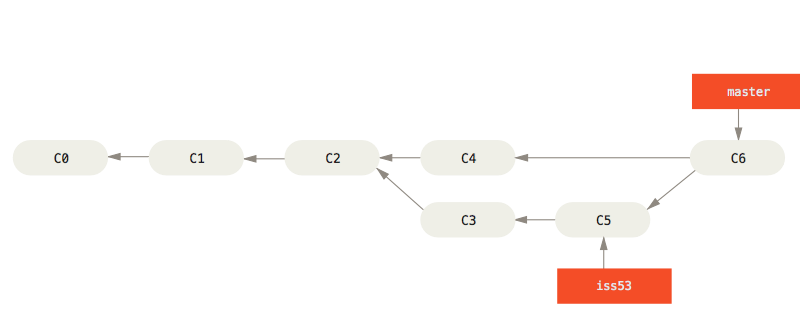

# git 讲解

## 1.起步

### 1.1 版本控制简介

你可以把一个版本控制系统（缩写VCS）理解为一个“数据库”，在需要的时候，它可以帮你完整地保存一个项目的快照。当你需要查看一个之前的快照（称之为“版本”）时，版本控制系统可以显示出当前版本与上一个版本之间的所有改动的细节。


版本控制与项目的种类，使用的技术和基础框架并无关系：

- 无论是设计开发一个HTML网站或者是一个苹果应用，它的工作原理都是一样的。
- 你可以选择任何你喜欢的工具来工作，它并不关心你用什么样的文本编辑器，绘图程序，文件管理器或其他工具。

版本控制系统会记录所有对项目文件的更改。这就是版本控制，听起来很简单。

###  1.2 为什么要使用版本控制系统

#### 协同合作

试想一下，如果没有版本控制系统，当你需要处理那些共享文件夹中的文件时，你必须告知办公室里的所有人，你正在对哪些文件进行编辑；与此同时，其他人必须要避免与操作相同的文件。这是一个不现实和完全错误的流程。当你花了很长时间完成你的编辑后，可能这些文件早已经被团队里的其他开发成员修改或者删除了。

如果使用了版本控制系统，每一个团队成员都可以在任何时间对任何文件毫无顾虑的进行修改，版本控制系统可以把之后所有的改动合并成一个共同的版本，不论是一个文件还是整个项目。这个共同的中心平台就是我们的版本控制系统。

使用版本控制还有更多优点，这就要取决于你自己或者你的开发团队了。

#### 版本存储

经常性地保存项目的改动是一个非常重要的习惯。但是如果没有版本控制系统这个操作将是非常困难的，并且非常容易出错的：

- 你到底改动了什么？仅仅是针对一些特定文件的改动还是整个项目？首先你必须及时并小心地审查整个项目的每一个可能的改动细节，然后你需要付出大量且并不必要的时间来整理它。
- 你如何命名这些版本？如果你是一个思维很有条理的人，你也许会定义一个比较容易理解的通用命名规则（比如这样 “acme-inc-redesign-2013-11-12-v23”）。然而一旦涉及到一个多样性的改变（比如：在一次版本改动中，一些改动了标题区而另一些却没有被改动它），仅仅通过名字是很难追踪和判断这些改动的。
- 最重要的问题可能就是你如何知道在第一个版本和第二个版本之间到底进行了哪些改动？只有很少人会真正地去花时间来仔细记录和观察每一个重要的变化，例如在项目文件夹的每一个README文件。

每一个版本控制系统仅仅对应一个项目。因此，在你的本地只存在一个版本，那就是这个项目的当前工作版本。除此之外，而其它所有之前的版本和改动都已经被有序地存储在版本控制系统中了。当你需要时，你可以随时来查看之前的任何一个版本，而且还可以得到整个项目的快照。

#### 恢复之前的版本

要把一些文件恢复到上次改动之前的版本（甚至整个项目恢复到之前的版本）。这可能意味着你发现了一些严重的问题！如果你确定那些改动是错误的或者是没有必要的，那轻松的点几下你就可以简单地撤销它。在项目的每一个重要阶段，认识和正确地使用撤销这个功能会让你的工作变得非常轻松。

#### 了解发生了什么

每当你提交一次对项目新的改动时，你的版本管理系统会要求你添加一个对这次改动的简短描述。除此之外（如果是一个代码或者文本文件），你还可以看到一个改动前和改动后的内容的详细对照。这样也可以帮助你很好地了解版本与版本之间的发展关系。

#### 备份

备份是一个分布式版本控制系统（例如 Git）提供的非常好的附带功能。每一个团队成员都会在他的本地有一个完整的项目副本，包括整个项目的历史记录。如果你所依赖的服务器宕机了，或者是你的存储硬盘坏，所有你需要的恢复文件都可以在另外的团队成员的 Git 本地仓库中得到。

### 1.3 有哪些版本控制系统

许多人习惯用复制整个项目目录的方式来保存不同的版本，或许还会改名加上备份时间以示区别。 这么做唯一的好处就是简单，但是特别容易犯错。 有时候会混淆所在的工作目录，一不小心会写错文件或者覆盖意想外的文件。

#### 本地版本控制系统


其中最流行的一种叫做 RCS，现今许多计算机系统上都还看得到它的踪影。 [RCS](https://www.gnu.org/software/rcs/) 的工作原理是在硬盘上保存补丁集（补丁是指文件修订前后的变化）；通过应用所有的补丁，可以重新计算出各个版本的文件内容。

#### 集中化的版本控制系统


这种做法带来了许多好处，特别是相较于老式的本地 VCS 来说。 现在，每个人都可以在一定程度上看到项目中的其他人正在做些什么。 而管理员也可以轻松掌控每个开发者的权限，并且管理一个 CVCS 要远比在各个客户端上维护本地数据库来得轻松容易。

事分两面，有好有坏。 这么做最显而易见的缺点是中央服务器的单点故障。 如果宕机一小时，那么在这一小时内，谁都无法提交更新，也就无法协同工作。 如果中心数据库所在的磁盘发生损坏，又没有做恰当备份，毫无疑问你将丢失所有数据——包括项目的整个变更历史，只剩下人们在各自机器上保留的单独快照。 本地版本控制系统也存在类似问题，只要整个项目的历史记录被保存在单一位置，就有丢失所有历史更新记录的风险。

#### 分布式版本控制系统


更进一步，许多这类系统都可以指定和若干不同的远端代码仓库进行交互。籍此，你就可以在同一个项目中，分别和不同工作小组的人相互协作。 你可以根据需要设定不同的协作流程，比如层次模型式的工作流，而这在以前的集中式系统中是无法实现的。

### 1.4 git

**git**是一个[分布式版本控制](https://zh.wikipedia.org/wiki/分散式版本控制)软件，最初由[林纳斯·托瓦兹](https://zh.wikipedia.org/wiki/林纳斯·托瓦兹)创作，于2005年以[GPL](https://zh.wikipedia.org/wiki/GPL)发布。最初目的是为更好地管理[Linux内核](https://zh.wikipedia.org/wiki/Linux内核)开发而设计。

自2002年开始，林纳斯·托瓦兹决定使用BitKeeper作为Linux内核主要的版本控制系统用以维护代码。因为BitKeeper为[专有软件](https://zh.wikipedia.org/wiki/专有软件)，这个决定在社群中长期遭受质疑。在Linux社群中，特别是[理查德·斯托曼](https://zh.wikipedia.org/wiki/理查德·斯托曼)与[自由软件基金会](https://zh.wikipedia.org/wiki/自由軟體基金會)的成员，主张应该使用开放源代码的软件来作为Linux内核的版本控制系统。林纳斯·托瓦兹曾考虑过采用现成软件作为版本控制系统（例如Monotone），但这些软件都存在一些问题，特别是性能不佳。现成的方案，如[CVS](https://zh.wikipedia.org/wiki/協作版本系統)的架构，受到林纳斯·托瓦兹的批评。

2005年，[安德鲁·垂鸠](https://zh.wikipedia.org/wiki/安德魯·垂鳩)写了一个简单程序，可以连接BitKeeper的存储库，BitKeeper著作权拥有者[拉里·麦沃伊](https://zh.wikipedia.org/wiki/拉里·麥沃伊)认为安德鲁·垂鸠对BitKeeper内部使用的[协议](https://zh.wikipedia.org/wiki/网络传输协议)进行[逆向工程](https://zh.wikipedia.org/wiki/逆向工程)，决定收回无偿使用BitKeeper的许可。Linux内核开发团队与BitMover公司进行磋商，但无法解决他们之间的歧见。林纳斯·托瓦兹决定自行开发版本控制系统替代BitKeeper，以十天的时间编写出git第一个版本。

### 1.5 命令行

Git 有多种使用方式。 你可以使用原生的命令行模式，也可以使用 GUI 模式，这些 GUI 软件也能提供多种功能。 假如你是 macOS 用户，我们希望你懂得如何使用终端（Terminal）；假如你是 Windows 用户，我们希望你懂得如何使用命令窗口（Command Prompt）或 PowerShell。强烈建议大家在开始的时候使用命令行学习git。

### 1.6 git安装

苹果电脑（macos系统）或者Ubuntu安装教程，自行上网查找，主要以windows为例。

#### windows安装

官网下载，打开https://git-scm.com/download/win，就可以自动开始下载。下载完成之后，直接按提示安装就可以了。

### 1.7 初次使用git前配置

安装好git之后，首次使用前我们需要配置下git的环境。后续即使是升级都会保留配置信息，并且我们后续也可以通过运行命令修改配置。

`git config` 命令可以对git的外观和行为进行设置。这些设置存在三个不同的位置：

1. `/etc/gitconfig` 文件: 包含系统上每一个用户及他们仓库的通用配置。 如果在执行 `git config` 时带上 `--system` 选项，那么它就会读写该文件中的配置变量。 （由于它是系统配置文件，因此你需要管理员或超级用户权限来修改它。）
2. `~/.gitconfig` 或 `~/.config/git/config` 文件：只针对当前用户。 你可以传递 `--global` 选项让 Git 读写此文件，这会对你系统上 **所有** 的仓库生效。
3. 当前使用仓库的 Git 目录中的 `config` 文件（即 `.git/config`）：针对该仓库。 你可以传递 `--local` 选项让 Git 强制读写此文件，虽然默认情况下用的就是它。。 （当然，你需要进入某个 Git 仓库中才能让该选项生效。）

配置文件依次会覆盖上一级别的配置

#### 重点（配置用户信息）

```shell
git config --global user.name 'huirui'
git config --global user.email '1017669154@qq.com'
```

如果使用了 `--global` 选项，那么该命令只需要运行一次，因为之后无论你在该系统上做任何事情， Git 都会使用那些信息。 当你想针对特定项目使用不同的用户名称与邮件地址时，可以在那个项目目录下运行没有 `--global` 选项的命令来配置。

很多`GUI`(图形化界面)工具第一次运行时都会帮你配置这些信息

#### 检查配置

```shell
git config --list
```

#### 查看具体某一项配置

```shell
git config user.name
```

### 1.8 git帮助命令

通过一下三种方式可以查看git命令的综合手册（manpage)

```shell
git help init
git init --help
man git-init (linux操作系统使用)
```

如果不需要全面的手册可以使用-h选项获取简明的输出：

```shell
git init -h
```

## 2.git基础

### 2.1获取git仓库

通常有两种方式获取git仓库：

1、将本地尚未进行版本控制的项目目录转换为git仓库

2、从远程的服务器 **克隆**一个已经存在的git仓库

两种方式都可以在你的本地机器上得到一个工作就绪的git仓库

#### 在已经存在的目录中初始化仓库

如果你有一个尚未进行版本控制的项目目录，想要用 Git 来控制它，那么首先需要进入该项目目录中。

之后执行：

```shell
git init
```

该命令会创建一个名为.git的子目录，这个子目录含有你初始化git仓库中所有的必须文件，这些文件是git仓库的骨干。但是，这个时候，我们仅仅只是做了一个初始化的操作，你的项目里的文件还没有被跟踪。（后面会讲解.git文件夹包含了哪些文件信息）

如果在一个已存在文件的文件夹（而非空文件夹）中进行版本控制，你应该开始追踪这些文件并进行初始提交。 可以通过 `git add` 命令来指定所需的文件来进行追踪，然后执行 `git commit` ：

```shell
git add *
git commit -m '初始化项目'
```

稍后我们再逐一解释这些指令的行为。 现在，你已经得到了一个存在被追踪文件与初始提交的 Git 仓库。

#### 克隆现有的仓库

如果你想获得一份已经存在了的 Git 仓库的拷贝，比如说，你想为vue.js开源项目贡献自己的一份力，这时就要用到 `git clone` 命令。

Git 区别于其它版本控制系统的一个重要特性，Git 克隆的是该 Git 仓库服务器上的几乎所有数据，而不是仅仅复制完成你的工作所需要文件。 当你执行 `git clone` 命令的时候，默认配置下远程 Git 仓库中的每一个文件的每一个版本都将被拉取下来。 事实上，如果你的服务器的磁盘坏掉了，你通常可以使用任何一个克隆下来的用户端来重建服务器上的仓库

克隆仓库的命令是`git clone <url>`。比如，要克隆vuejs的git仓库，可以使用下面命令：

```shell
git clone https://github.com/vuejs/vue
```

这会在当前目录下创建一个名为 “vue” 的目录，并在这个目录下初始化一个 `.git` 文件夹， 从远程仓库拉取下所有数据放入 `.git` 文件夹，然后从中读取最新版本的文件的拷贝。 如果你进入到这个新建的 vue文件夹，你会发现所有的项目文件已经在里面了，准备就绪等待后续的开发和使用。

如果你想在克隆远程仓库的时候，自定义本地仓库的名字，你可以通过额外的参数指定新的目录名：

```shell
git clone https://github.com/vuejs/vue vuejs
```

这会执行与上一条命令相同的操作，但目标目录名变为了 `vuejs`。

Git 支持多种数据传输协议。 上面的例子使用的是 `https://` 协议，不过你也可以使用 `git://` 协议或者使用 SSH 传输协议，比如 `user@server:path/to/repo.git`  （后面将会介绍所有这些协议在服务器端如何配置使用，以及各种方式之间的利弊。）

### 2.2记录每次更新到仓库

现在我们的机器上有了一个 **真实项目** 的 Git 仓库，并从这个仓库中检出了所有文件的 **工作副本**。 通常，你会对这些文件做些修改，每当完成了一个阶段的目标，想要将记录下它时，就将它提交到仓库。

请记住，你工作目录下的每一个文件都不外乎这两种状态：**已跟踪** 或 **未跟踪**。 已跟踪的文件是指那些被纳入了版本控制的文件，在上一次快照中有它们的记录，在工作一段时间后， 它们的状态可能是未修改，已修改或已放入暂存区。简而言之，已跟踪的文件就是 Git 已经知道的文件。

工作目录中除已跟踪文件外的其它所有文件都属于未跟踪文件，它们既不存在于上次快照的记录中，也没有被放入暂存区。 初次克隆某个仓库的时候，工作目录中的所有文件都属于已跟踪文件，并处于未修改状态，因为 Git 刚刚检出了它们， 而你尚未编辑过它们。

编辑过某些文件之后，由于自上次提交后你对它们做了修改，Git 将它们标记为已修改文件。 在工作时，你可以选择性地将这些修改过的文件放入暂存区，然后提交所有已暂存的修改，如此反复。


#### 检查当前文件状态

可以用 `git status` 命令查看哪些文件处于什么状态。 如果在克隆仓库后立即使用此命令，会看到类似这样的输出：

```shell
git status
On branch master
Your branch is up-to-date with 'origin/master'.
nothing to commit, working directory clean
```

这说明你现在的工作目录相当干净。换句话说，所有已跟踪文件在上次提交后都未被更改过。 此外，上面的信息还表明，当前目录下没有出现任何处于未跟踪状态的新文件，否则 Git 会在这里列出来。 最后，该命令还显示了当前所在分支，并告诉你这个分支同远程服务器上对应的分支没有偏离。 现在，分支名是“master”,这是默认的分支名。 我们在 分支部分 会详细讨论分支和引用。

现在，让我们在项目下创建一个新的 `README` 文件。 如果之前并不存在这个文件，使用 `git status` 命令，你将看到一个新的未跟踪文件：

```shell
 git status
On branch master
Your branch is up-to-date with 'origin/master'.
Untracked files:
  (use "git add <file>..." to include in what will be committed)

    README

nothing added to commit but untracked files present (use "git add" to track)
```

在状态报告中可以看到新建的 `README` 文件出现在 `Untracked files` 下面。 未跟踪的文件意味着 Git 在之前的快照（提交）中没有这些文件；Git 不会自动将之纳入跟踪范围，除非你明明白白地告诉它“我需要跟踪该文件”。 这样的处理让你不必担心将生成的二进制文件或其它不想被跟踪的文件包含进来。 不过现在的例子中，我们确实想要跟踪管理 `README` 这个文件。

#### 跟踪新文件

使用命令 `git add` 开始跟踪一个文件。 所以，要跟踪 `README` 文件，运行：

```shell
git add README
```

此时再运行 `git status` 命令，会看到 `README` 文件已被跟踪，并处于暂存状态:

```console
git status
On branch master
Your branch is up-to-date with 'origin/master'.
Changes to be committed:
  (use "git restore --staged <file>..." to unstage)

    new file:   README
```

只要在 `Changes to be committed` 这行下面的，就说明是已暂存状态。 如果此时提交，那么该文件在你运行 `git add` 时的版本将被留存在后续的历史记录中。 你可能会想起之前我们使用 `git init` 后就运行了 `git add <files>` 命令，开始跟踪当前目录下的文件。 `git add` 命令使用文件或目录的路径作为参数；如果参数是目录的路径，该命令将递归地跟踪该目录下的所有文件。

#### 暂存已修改的文件

现在我们来修改一个已被跟踪的文件。 如果你修改了一个名为` README.md` 的已被跟踪的文件，然后运行 `git status` 命令，会看到下面内容：

```console
git status
On branch master
Your branch is up-to-date with 'origin/master'.
Changes to be committed:
  (use "git reset HEAD <file>..." to unstage)

    new file:   README

Changes not staged for commit:
  (use "git add <file>..." to update what will be committed)
  (use "git checkout -- <file>..." to discard changes in working directory)

    modified:   README.md
```

文件 `README.md` 出现在 `Changes not staged for commit` 这行下面，说明已跟踪文件的内容发生了变化，但还没有放到暂存区。 要暂存这次更新，需要运行 `git add` 命令。 这是个多功能命令：可以用它开始跟踪新文件，或者把已跟踪的文件放到暂存区，还能用于合并时把有冲突的文件标记为已解决状态等。 将这个命令理解为“精确地将内容添加到下一次提交中”而不是“将一个文件添加到项目中”要更加合适。 现在让我们运行 `git add` 将`README.md`放到暂存区，然后再看看 `git status` 的输出：

```console
git add README.md
git status
On branch master
Your branch is up-to-date with 'origin/master'.
Changes to be committed:
  (use "git reset HEAD <file>..." to unstage)

    new file:   README
    modified:   REAMDE.md
```

现在两个文件都已暂存，下次提交时就会一并记录到仓库。 假设此时，你想要在 `README.md` 里再加条注释。 重新编辑存盘后，准备好提交。 不过且慢，再运行 `git status` 看看：

```console
git status
On branch master
Your branch is up-to-date with 'origin/master'.
Changes to be committed:
  (use "git reset HEAD <file>..." to unstage)

    new file:   README
    modified:   README.md

Changes not staged for commit:
  (use "git add <file>..." to update what will be committed)
  (use "git checkout -- <file>..." to discard changes in working directory)

    modified:   README.md
```

怎么回事？ 现在 `README.md` 文件同时出现在暂存区和非暂存区。 这怎么可能呢？ 好吧，实际上 Git 只不过暂存了你运行 `git add` 命令时的版本。 如果你现在提交，`README.md` 的版本是你最后一次运行 `git add` 命令时的那个版本，而不是你运行 `git commit` 时，在工作目录中的当前版本。 所以，运行了 `git add` 之后又作了修订的文件，需要重新运行 `git add` 把最新版本重新暂存起来：

```console
git add README.md
$ git status
On branch master
Your branch is up-to-date with 'origin/master'.
Changes to be committed:
  (use "git reset HEAD <file>..." to unstage)

    new file:   README
    modified:   README.md
```

#### 状态简览

`git status` 命令的输出十分详细，但其用语有些繁琐。 Git 有一个选项可以帮你缩短状态命令的输出，这样可以以简洁的方式查看更改。 如果你使用 `git status -s` 命令或 `git status --short` 命令，你将得到一种格式更为紧凑的输出。

```shell
git status -s
MM git-scm.md
   index.js
```

新添加的未跟踪文件前面有 `??` 标记，新添加到暂存区中的文件前面有 `A` 标记，修改过的文件前面有 `M` 标记。 输出中有两栏，左栏指明了暂存区的状态，右栏指明了工作区的状态。 `git-scm.md` 文件已修，暂存后又作了修改，因此该文件的修改中既有已暂存的部分，又有未暂存的部分。

#### 忽略文件

一般我们总会有些文件无需纳入 Git 的管理，也不希望它们总出现在未跟踪文件列表。 通常都是些自动生成的文件，比如日志文件，或者编译过程中创建的临时文件等。 在这种情况下，我们可以创建一个名为 `.gitignore` 的文件，列出要忽略的文件的模式。 来看一个实际的 `.gitignore` 例子：

#### 查看已暂存和未暂存的修改

如果 `git status` 命令的输出对于你来说过于简略，而你想知道具体修改了什么地方，可以用 `git diff` 命令。 你通常可能会用它来回答这两个问题：当前做的哪些更新尚未暂存？ 有哪些更新已暂存并准备好下次提交？ 虽然 `git status` 已经通过在相应栏下列出文件名的方式回答了这个问题，但 `git diff` 能通过文件补丁的格式更加具体地显示哪些行发生了改变。

假如再次修改 `inde.js`文件后暂存，然后编辑 `index.html` 文件后先不暂存， 运行 `git status` 命令将会看到：

```shell
 git status
On branch test
Changes to be committed:
  (use "git restore --staged <file>..." to unstage)
        modified:   index.js

Changes not staged for commit:
  (use "git add <file>..." to update what will be committed)
  (use "git restore <file>..." to discard changes in working directory)
        modified:   index.html
```

要查看尚未暂存的文件更新了哪些部分，不加参数直接输入 `git diff`：

```shell
git diff
diff --git a/index.html b/index.html
index 1348707..a6503c5 100644
--- a/index.html
+++ b/index.html
@@ -1,5 +1,2 @@
 html
 test
-test
-html
-html
```

此命令比较的是工作目录中当前文件和暂存区域快照之间的差异。 也就是修改之后还没有暂存起来的变化内容。

若要查看已暂存的将要添加到下次提交里的内容，可以用 `git diff --staged` 命令。 这条命令将比对已暂存文件与最后一次提交的文件差异：

```shell
 git diff --staged
diff --git a/index.js b/index.js
index 3a53a26..da74bb6 100644
--- a/index.js
+++ b/index.js
@@ -1,15 +1,2 @@
 console.log(_)
 console.log(_)
-console.log(_)
-console.log(_)
-console.log(_)
-console.log(_)
-console.log(_)
-console.log(_)
-console.log(_)
-console.log(_)
-console.log(_)
-console.log(_)
-console.log(_)
-
-
```

请注意，git diff 本身只显示尚未暂存的改动，而不是自上次提交以来所做的所有改动。 所以有时候你一下子暂存了所有更新过的文件，运行 `git diff` 后却什么也没有，就是这个原因。

我们使用 `git diff` 来分析文件差异。 但是你也可以使用图形化的工具或外部 diff 工具来比较差异。 可以使用 `git difftool` 命令来调用 emerge 或 vimdiff 等软件（包括商业软件）输出 diff 的分析结果。 使用 `git difftool --tool-help` 命令来看你的系统支持哪些 Git Diff 插件。

#### 提交更新

现在的暂存区已经准备就绪，可以提交了。 在此之前，请务必确认还有什么已修改或新建的文件还没有 `git add` 过， 否则提交的时候不会记录这些尚未暂存的变化。 这些已修改但未暂存的文件只会保留在本地磁盘。 所以，每次准备提交前，先用 `git status` 看下，你所需要的文件是不是都已暂存起来了， 然后再运行提交命令 `git commit` -m '****'：

```shell
git commit -m 'xxxx'
```

#### 跳过使用暂存区

尽管使用暂存区域的方式可以精心准备要提交的细节，但有时候这么做略显繁琐。 Git 提供了一个跳过使用暂存区域的方式， 只要在提交的时候，给 `git commit` 加上 `-a` 选项，Git 就会自动把所有已经跟踪过的文件暂存起来一并提交，从而跳过 `git add` 步骤：

```
git commit -a -m 'XXXX' || git commit -am 'XXXX'
```

#### 移除文件

要从 Git 中移除某个文件，就必须要从已跟踪文件清单中移除（确切地说，是从暂存区域移除），然后提交。 可以用 `git rm` 命令完成此项工作，并连带从工作目录中删除指定的文件，这样以后就不会出现在未跟踪文件清单中了。

如果只是简单地从工作目录中手工删除`index.js`文件，运行 `git status` 时就会在 “Changes not staged for commit” 部分（也就是 *未暂存清单*）看到：

```shell
 git status
On branch test
Changes not staged for commit:
  (use "git add/rm <file>..." to update what will be committed)
  (use "git restore <file>..." to discard changes in working directory)
        deleted:    index.js

no changes added to commit (use "git add" and/or "git commit -a")
```

然后再运行 `git rm` 记录此次移除文件的操作：

```shell
git rm index.js
rm 'index.js'
git status
On branch test
Changes to be committed:
  (use "git restore --staged <file>..." to unstage)
        deleted:    index.js

```

下一次提交时，该文件就不再纳入版本管理了。 如果要删除之前修改过或已经放到暂存区的文件，则必须使用强制删除选项 `-f`（译注：即 force 的首字母）。 这是一种安全特性，用于防止误删尚未添加到快照的数据，这样的数据不能被 Git 恢复。

另外一种情况是，我们想把文件从 Git 仓库中删除（亦即从暂存区域移除），但仍然希望保留在当前工作目录中。 换句话说，你想让文件保留在磁盘，但是并不想让 Git 继续跟踪。 当你忘记添加 `.gitignore` 文件，不小心把一个很大的日志文件或一堆 `.a` 这样的编译生成文件添加到暂存区时，这一做法尤其有用。 为达到这一目的，使用 `--cached` 选项：

```shell
git rm --cached index.js
```

#### 移动文件

要在 Git 中对文件改名，可以这么做：

```shell
git mv file_from file_to
```

```shell
git mv index.js index.ts
git status
On branch test
Changes to be committed:
  (use "git restore --staged <file>..." to unstage)
        renamed:    index.js -> index.ts
```

### 2.3 查看提交历史

在提交了若干更新，又或者克隆了某个项目之后，你也许想回顾下提交历史。 完成这个任务最简单而又有效的工具是 `git log` 命令。

当你在此项目中运行 `git log` 命令时，可以看到类似下面的输出：

```shell
git log
commit 5335d8c71ec66e1fab9329193717468720e1e522 (HEAD -> test)
Author: rlwb <rlwb1017669154@gmail.com>
Date:   Tue Nov 30 22:18:15 2021 +0800

    un

commit f35c7f32a4a78d619eb32affa9521b4b3c97e643
Author: rlwb <rlwb1017669154@gmail.com>
Date:   Thu Jul 29 23:17:28 2021 +0800

    2 & rebase & amend

commit 2f2c841f0798332d1beb5246b6dc8a2cccc9bb0e
Author: rlwb <rlwb1017669154@gmail.com>
Date:   Thu Jul 29 23:17:05 2021 +0800

    dsad

commit 45b28fd738696f2b09e9692883b91e630a850bda
Author: rlwb <rlwb1017669154@gmail.com>
Date:   Thu Jul 29 23:15:13 2021 +0800

    init
```

不传入任何参数的默认情况下，`git log` 会按时间先后顺序列出所有的提交，最近的更新排在最上面。 正如你所看到的，这个命令会列出每个提交的 SHA-1 校验和、作者的名字和电子邮件地址、提交时间以及提交说明。

`git log` 有许多选项可以帮助你搜寻你所要找的提交， 下面介绍几个最常用的选项。

其中一个比较有用的选项是 `-p` 或 `--patch` ，它会显示每次提交所引入的差异（按 **补丁** 的格式输出）。 你也可以限制显示的日志条目数量，例如使用 `-2` 选项来只显示最近的两次提交：

```shell
λ git log -p -2
commit 5335d8c71ec66e1fab9329193717468720e1e522 (HEAD -> test)
Author: rlwb <rlwb1017669154@gmail.com>
Date:   Tue Nov 30 22:18:15 2021 +0800

    un

diff --git a/index.html b/index.html
index 1348707..a6503c5 100644
--- a/index.html
+++ b/index.html
@@ -1,5 +1,2 @@
 html
 test
-test
-html
-html

commit f35c7f32a4a78d619eb32affa9521b4b3c97e643
Author: rlwb <rlwb1017669154@gmail.com>
Date:   Thu Jul 29 23:17:28 2021 +0800

    2 & rebase & amend

diff --git a/index.html b/index.html
index d952eaa..1348707 100644
--- a/index.html
+++ b/index.html
@@ -1,2 +1,5 @@
 html
+test
+test
+html
 html
(END)
```

你想看到每次提交的简略统计信息，可以使用 `--stat` 选项：

```shell
 git log --stat
commit 5335d8c71ec66e1fab9329193717468720e1e522 (HEAD -> test)
Author: rlwb <rlwb1017669154@gmail.com>
Date:   Tue Nov 30 22:18:15 2021 +0800

    un

 index.html | 3 ---
 1 file changed, 3 deletions(-)

commit f35c7f32a4a78d619eb32affa9521b4b3c97e643
Author: rlwb <rlwb1017669154@gmail.com>
Date:   Thu Jul 29 23:17:28 2021 +0800

    2 & rebase & amend

 index.html | 3 +++
 1 file changed, 3 insertions(+)
```

正如你所看到的，`--stat` 选项在每次提交的下面列出所有被修改过的文件、有多少文件被修改了以及被修改过的文件的哪些行被移除或是添加了。 在每次提交的最后还有一个总结

另一个非常有用的选项是 `--pretty`。 这个选项可以使用不同于默认格式的方式展示提交历史。 这个选项有一些内建的子选项供你使用。 比如 `oneline` 会将每个提交放在一行显示，在浏览大量的提交时非常有用。 另外还有 `short`，`full` 和 `fuller` 选项，它们展示信息的格式基本一致，但是详尽程度不一：

```shell
git log --pretty=oneline
5335d8c71ec66e1fab9329193717468720e1e522 (HEAD -> test) un
f35c7f32a4a78d619eb32affa9521b4b3c97e643 2 & rebase & amend
2f2c841f0798332d1beb5246b6dc8a2cccc9bb0e dsad
45b28fd738696f2b09e9692883b91e630a850bda init
```

`log` 选项 `--graph` 结合使用时尤其有用。 这个选项添加了一些 ASCII 字符串来形象地展示你的分支、合并历史：

```shell
git log --graph
*   commit 827639334f4717ee189e5f877acb043f000defe8 (HEAD -> test)
|\  Merge: def4aba 80eb03b
| | Author: rlwb <rlwb1017669154@gmail.com>
| | Date:   Tue Nov 30 22:44:16 2021 +0800
| |
| |     merge
| |
| * commit 80eb03b03d7af695ed1f833e0976e86e33d1d59b (master)
| | Author: rlwb <rlwb1017669154@gmail.com>
| | Date:   Fri Jul 30 00:12:43 2021 +0800
| |
| |     finished
| |
| * commit fd4038e5c73f91469feb9753d26ea47afefa237e
| | Author: rlwb <rlwb1017669154@gmail.com>
| | Date:   Thu Jul 29 23:21:17 2021 +0800
| |
| |     rebase
| |
| * commit 9d92f59615874c8a7e4a3f69d10729b80802e2ee
| | Author: rlwb <rlwb1017669154@gmail.com>
| | Date:   Thu Jul 29 23:17:28 2021 +0800
| |
| |     2
```

后面我们会在分支合并章节讲解

git log还有其他更多有趣的组合，感兴趣的同学可以课后google一下。

### 2.4 git撤销操作

在任何一个阶段，你都有可能想要撤消某些操作。 这里，我们将会学习几个撤消你所做修改的基本工具。 注意，有些撤消操作是不可逆的。 这是在使用 Git 的过程中，会因为操作失误而导致之前的工作丢失的少有的几个地方之一。

有时候我们提交完了才发现漏掉了几个文件没有添加，或者提交信息写错了。 此时，可以运行带有 `--amend` 选项的提交命令来重新提交：

```shell
git commit --amend
```

这个命令会将暂存区中的文件提交。 如果自上次提交以来你还未做任何修改（例如，在上次提交后马上执行了此命令）， 那么快照会保持不变，而你所修改的只是提交信息。

文本编辑器启动后，可以看到之前的提交信息。 编辑后保存会覆盖原来的提交信息.

例如，你提交后发现忘记了暂存某些需要的修改，可以像下面这样操作：

```shell
$ git commit -m 'initial commit'
$ git add forgotten_file
$ git commit --amend
```

#### 取消暂存的文件

如何操作暂存区和工作目录中已修改的文件。 这些命令在修改文件状态的同时，也会提示如何撤消操作。 例如，你已经修改了两个文件并且想要将它们作为两次独立的修改提交， 但是却意外地输入 `git add *` 暂存了它们两个。如何只取消暂存两个中的一个呢？ `git status` 命令提示了你：

```shell
git add *
git status
On branch master
Changes to be committed:
  (use "git restore --staged <file>..." to unstage)

    renamed:    README.md -> README
    modified:   index.js
```

在 “Changes to be committed” 文字正下方，提示使用 `git reset HEAD <file>...` 来取消暂存。 所以，我们可以这样来取消暂存 `index.js` 文件：

#### 撤销对文件的修改

如果你并不想保留对 `index.js` 文件的修改怎么办？ 你该如何方便地撤消修改——将它还原成上次提交时的样子（或者刚克隆完的样子，或者刚把它放入工作目录时的样子）？ 幸运的是，`git status` 也告诉了你应该如何做。 在最后一个例子中，未暂存区域是这样：

```shell
Changes not staged for commit:
  (use "git add <file>..." to update what will be committed)
  (use "git restore <file>..." to discard changes in working directory)

    modified:   index.js
```

它非常清楚地告诉了你如何撤消之前所做的修改。 让我们来按照提示执行：

```shell
git checkout -- CONTRIBUTING.md
$ git status
On branch master
Changes to be committed:
  (use "git restore --staged <file>..." to unstage)

    renamed:    README.md -> README
```

可以看到那些修改已经被撤消了

如果你仍然想保留对那个文件做出的修改，但是现在仍然需要撤消，我们将会在git 分支介绍保存进度与分支，这通常是更好的做法。

记住，在 Git 中任何 **已提交** 的东西几乎总是可以恢复的。 甚至那些被删除的分支中的提交或使用 `--amend` 选项覆盖的提交也可以恢复 。 然而，任何你未提交的东西丢失后很可能再也找不到了。

### 2.5 远程仓库的使用

为了能在任意 Git 项目上协作，你需要知道如何管理自己的远程仓库。 远程仓库是指托管在因特网或其他网络中的你的项目的版本库。 你可以有好几个远程仓库，通常有些仓库对你只读，有些则可以读写。 与他人协作涉及管理远程仓库以及根据需要推送或拉取数据。 管理远程仓库包括了解如何添加远程仓库、移除无效的远程仓库、管理不同的远程分支并定义它们是否被跟踪等等。 在本节中，我们将介绍一部分远程管理的技能。

#### 查看远程仓库

如果想查看你已经配置的远程仓库服务器，可以运行 `git remote` 命令。 它会列出你指定的每一个远程服务器的简写。 如果你已经克隆了自己的仓库，那么至少应该能看到 origin ——这是 Git 给你克隆的仓库服务器的默认名字：

```shell
git clone https://github.com/vuejs/vue
Cloning into 'vue'...
remote: Reusing existing pack: 1857, done.
remote: Total 1857 (delta 0), reused 0 (delta 0)
Receiving objects: 100% (1857/1857), 374.35 KiB | 268.00 KiB/s, done.
Resolving deltas: 100% (772/772), done.
Checking connectivity... done.
cd vue
git remote
origin
```

你也可以指定选项 `-v`，会显示需要读写远程仓库使用的 Git 保存的简写与其对应的 URL。

```shell
git remote -v
origin	https://github.com/schacon/ticgit (fetch)
origin	https://github.com/schacon/ticgit (push)
```

如果你的远程仓库不止一个，该命令会将它们全部列出。 例如，与几个协作者合作的，拥有多个远程仓库的仓库看起来像下面这样：

```shell
git remote -v
bakkdoor  https://github.com/bakkdoor/grit (fetch)
bakkdoor  https://github.com/bakkdoor/grit (push)
cho45     https://github.com/cho45/grit (fetch)
cho45     https://github.com/cho45/grit (push)
defunkt   https://github.com/defunkt/grit (fetch)
defunkt   https://github.com/defunkt/grit (push)
koke      git://github.com/koke/grit.git (fetch)
koke      git://github.com/koke/grit.git (push)
origin    git@github.com:mojombo/grit.git (fetch)
origin    git@github.com:mojombo/grit.git (push)
```

这表示我们能非常方便地拉取其它用户的贡献。我们还可以拥有向他们推送的权限，这里暂不详述。

#### 添加远程仓库

我们在之前的章节中已经提到并展示了 `git clone` 命令是如何自行添加远程仓库的， 不过这里将告诉你如何自己来添加它。 运行 `git remote add <shortname> <url>` 添加一个新的远程 Git 仓库，同时指定一个方便使用的简写：

```shell l
git remote
origin
git remote add pb https://github.com/paulboone/ticgit
git remote -v
origin	https://github.com/schacon/ticgit (fetch)
origin	https://github.com/schacon/ticgit (push)
pb	https://github.com/paulboone/ticgit (fetch)
pb	https://github.com/paulboone/ticgit (push)
```

#### 从远程仓库抓取与拉取

从远程仓库中获得数据，可以执行：

```shell
git fetch <remote>
```

这个命令会访问远程仓库，从中拉取所有你还没有的数据。 执行完成后，你将会拥有那个远程仓库中所有分支的引用，可以随时合并或查看。

如果你的当前分支设置了跟踪远程分支， 那么可以用 `git pull` 命令来自动抓取后合并该远程分支到当前分支。 这或许是个更加简单舒服的工作流程。默认情况下，`git clone` 命令会自动设置本地 master 分支跟踪克隆的远程仓库的 `master` 分支（或其它名字的默认分支）。 运行 `git pull` 通常会从最初克隆的服务器上抓取数据并自动尝试合并到当前所在的分支。

#### 推送到远程仓库

当你想分享你的项目时，必须将其推送到上游。 这个命令很简单：`git push <remote> <branch>`。 当你想要将 `master` 分支推送到 `origin` 服务器时（再次说明，克隆时通常会自动帮你设置好那两个名字）， 那么运行这个命令就可以将你所做的备份到服务器：

```shell
git push origin master
```

只有当你有所克隆服务器的写入权限，并且之前没有人推送过时，这条命令才能生效。 当你和其他人在同一时间克隆，他们先推送到上游然后你再推送到上游，你的推送就会毫无疑问地被拒绝。 你必须先抓取他们的工作并将其合并进你的工作后才能推送。

#### 查看某个远程仓库

如果想要查看某一个远程仓库的更多信息，可以使用 `git remote show <remote>` 命令。 如果想以一个特定的缩写名运行这个命令，例如 `origin`，会得到像下面类似的信息：

```shell
git remote show origin
* remote origin
  Fetch URL: https://github.com/vuejs/vue
  Push  URL: https://github.com/vuejs/vue
  HEAD branch: master
  Remote branches:
    master                               tracked
    dev-branch                           tracked
  Local branch configured for 'git pull':
    master merges with remote master
  Local ref configured for 'git push':
    master pushes to master (up to date)
```

它同样会列出远程仓库的 URL 与跟踪分支的信息。 这些信息非常有用，它告诉你正处于 `master` 分支，并且如果运行 `git pull`， 就会抓取所有的远程引用，然后将远程 `master` 分支合并到本地 `master` 分支。 它也会列出拉取到的所有远程引用。

#### 远程仓库的重命名与移除

你可以运行 `git remote rename` 来修改一个远程仓库的简写名。 例如，想要将 `pb` 重命名为 `paul`，可以用 `git remote rename` 这样做：

```shell
git remote rename pb paul
git remote
origin
paul
```

值得注意的是这同样也会修改你所有远程跟踪的分支名字。 那些过去引用 `pb/master` 的现在会引用 `paul/master`。

如果因为一些原因想要移除一个远程仓库——你已经从服务器上搬走了或不再想使用某一个特定的镜像了， 又或者某一个贡献者不再贡献了——可以使用 `git remote remove` 或 `git remote rm` ：

```shell
git remote remove paul
git remote
origin
```

一旦你使用这种方式删除了一个远程仓库，那么所有和这个远程仓库相关的远程跟踪分支以及配置信息也会一起被删除。

### 2.6 git别名

Git 并不会在你输入部分命令时自动推断出你想要的命令。 如果不想每次都输入完整的 Git 命令，可以通过 `git config` 文件来轻松地为每一个命令设置一个别名。 这里有一些例子你可以试试：

```shell
git config --global alias.co checkout
git config --global alias.br branch
git config --global alias.ci commit
git config --global alias.st status
```

这意味着，当要输入 `git commit` 时，只需要输入 `git ci`。 随着你继续不断地使用 Git，可能也会经常使用其他命令，所以创建别名时不要犹豫。

在创建你认为应该存在的命令时这个技术会很有用。 例如，为了解决取消暂存文件的易用性问题，可以向 Git 中添加你自己的取消暂存别名：

```shell
 git config --global alias.unstage 'restore --staged'
```

这会使下面的两个命令等价：

```shell
git unstage fileA
git restore --staged fileA
```

## 3 git分支

### 3.1 分支简介

几乎所有的版本控制系统都以某种形式支持分支。 使用分支意味着你可以把你的工作从开发主线上分离开来，以免影响开发主线。 在很多版本控制系统中，这是一个略微低效的过程——常常需要完全创建一个源代码目录的副本。对于大项目来说，这样的过程会耗费很多时间。

有人把 Git 的分支模型称为它的“必杀技特性”，也正因为这一特性，使得 Git 从众多版本控制系统中脱颖而出。 为何 Git 的分支模型如此出众呢？ Git 处理分支的方式可谓是难以置信的轻量，创建新分支这一操作几乎能在瞬间完成，并且在不同分支之间的切换操作也是一样便捷。 与许多其它版本控制系统不同，Git 鼓励在工作流程中频繁地使用分支与合并，哪怕一天之内进行许多次。 理解和精通这一特性，你便会意识到 Git 是如此的强大而又独特，并且从此真正改变你的开发方式。

Git 的分支，其实本质上仅仅是指向提交对象的可变指针。 Git 的默认分支名字是 `master`。 在多次提交操作之后，你其实已经有一个指向最后那个提交对象的 `master` 分支。 `master` 分支会在每次提交时自动向前移动。

Git 的 `master` 分支并不是一个特殊分支。 它就跟其它分支完全没有区别。 之所以几乎每一个仓库都有 master 分支，是因为 `git init` 命令默认创建它，并且大多数人都懒得去改动它。

#### 创建分支

Git 是怎么创建新分支的呢？ 很简单，它只是为你创建了一个可以移动的新的指针。 比如，创建一个 testing 分支， 你需要使用 `git branch` 命令：

```shell
git branch testing
```

这会在当前所在的提交对象上创建一个指针。


那么，Git 又是怎么知道当前在哪一个分支上呢？ 也很简单，它有一个名为 `HEAD` 的特殊指针。 指向当前所在的本地分支（可以将 `HEAD` 想象为当前分支的别名）。 在本例中，你仍然在 `master` 分支上。 因为 `git branch` 命令仅仅 **创建** 一个新分支，并不会自动切换到新分支中去。


你可以简单地使用 `git log` 命令查看各个分支当前所指的对象。 提供这一功能的参数是 `--decorate`。

```shell
git log --oneline --decorate
f30ab (HEAD -> master, testing) add feature #32 - ability to add new formats to the central interface
34ac2 Fixed bug #1328 - stack overflow under certain conditions
98ca9 The initial commit of my project
```

正如你所见，当前 `master` 和 `testing` 分支均指向校验和以 `f30ab` 开头的提交对象。

#### 分支切换

要切换到一个已存在的分支，你需要使用 `git checkout` 命令。 我们现在切换到新创建的 `testing` 分支去：

```shell
git switch testing
```

这样 `HEAD` 就指向 `testing` 分支了


那么，这样的实现方式会给我们带来什么好处呢？ 现在不妨再提交一次：


如图所示，你的 `testing` 分支向前移动了，但是 `master` 分支却没有，它仍然指向运行 `git checkout` 时所指的对象。 这就有意思了，现在我们切换回 `master` 分支看看：

```shell
git switch master	
```


这条命令做了两件事。 一是使 HEAD 指回 `master` 分支，二是将工作目录恢复成 `master` 分支所指向的快照内容。 也就是说，你现在做修改的话，项目将始于一个较旧的版本。 本质上来讲，这就是忽略 `testing` 分支所做的修改，以便于向另一个方向进行开发。

我们不妨再稍微做些修改并提交：

```shell
vim index.js
git commit -a -m 'made other changes'
```

现在，这个项目的提交历史已经产生了分叉（参见 [项目分叉历史](https://git-scm.com/book/zh/v2/ch00/divergent_history)）。 因为刚才你创建了一个新分支，并切换过去进行了一些工作，随后又切换回 master 分支进行了另外一些工作。 上述两次改动针对的是不同分支：你可以在不同分支间不断地来回切换和工作，并在时机成熟时将它们合并起来。 而所有这些工作，你需要的命令只有 `branch`、`switch` 和 `commit`。


你可以简单地使用 `git log` 命令查看分叉历史。 运行 `git log --oneline --decorate --graph --all` ，它会输出你的提交历史、各个分支的指向以及项目的分支分叉情况。

```shell
git log --oneline --decorate --graph --all
* c2b9e (HEAD, master) made other changes
| * 87ab2 (testing) made a change
|/
* f30ab add feature #32 - ability to add new formats to the
* 34ac2 fixed bug #1328 - stack overflow under certain conditions
* 98ca9 initial commit of my project
```

由于 Git 的分支实质上仅是包含所指对象校验和（长度为 40 的 SHA-1 值字符串）的文件，所以它的创建和销毁都异常高效。 创建一个新分支就相当于往一个文件中写入 41 个字节（40 个字符和 1 个换行符），如此的简单能不快吗？

这与过去大多数版本控制系统形成了鲜明的对比，它们在创建分支时，将所有的项目文件都复制一遍，并保存到一个特定的目录。 完成这样繁琐的过程通常需要好几秒钟，有时甚至需要好几分钟。所需时间的长短，完全取决于项目的规模。 而在 Git 中，任何规模的项目都能在瞬间创建新分支。 同时，由于每次提交都会记录父对象，所以寻找恰当的合并基础（即共同祖先）也是同样的简单和高效。 这些高效的特性使得 Git 鼓励开发人员频繁地创建和使用分支。

#### 创建新分支的同时切换过去

通常我们会在创建一个新分支后立即切换过去，这可以用 `git switch -c <newbranchname>` 一条命令搞定。

### 3.2 分支的新建与合并

让我们来看一个简单的分支新建与分支合并的例子，实际工作中你可能会用到类似的工作流。 你将经历如下步骤：

1. 开发某个网站。
2. 为实现某个新的用户需求，创建一个分支。
3. 在这个分支上开展工作。

正在此时，你突然接到一个电话说有个很严重的问题需要紧急修补。 你将按照如下方式来处理：

1. 切换到你的线上分支（production branch）。
2. 为这个紧急任务新建一个分支，并在其中修复它。
3. 在测试通过之后，切换回线上分支，然后合并这个修补分支，最后将改动推送到线上分支。
4. 切换回你最初工作的分支上，继续工作。

#### 新建分支

首先，我们假设你正在你的项目上工作，并且在 `master` 分支上已经有了一些提交。


现在，你已经决定要解决你的公司使用的问题追踪系统中的 #53 问题。 想要新建一个分支并同时切换到那个分支上，你可以运行一个带有 `-c` 参数的 `git switch` 命令：

```shell
git switch -c iss53
Switched to a new branch "iss53"
```

它是下面两条命令的简写：

```shell
git branch iss53
git switch iss53
```


你继续在 #53 问题上工作，并且做了一些提交。 在此过程中，`iss53` 分支在不断的向前推进，因为你已经检出到该分支 （也就是说，你的 `HEAD` 指针指向了 `iss53` 分支）

```shell
vim index.html
git commit -a -m 'added a new footer [issue 53]'
```


现在你接到那个电话，有个紧急问题等待你来解决。 有了 Git 的帮助，你不必把这个紧急问题和 `iss53` 的修改混在一起， 你也不需要花大力气来还原关于 53# 问题的修改，然后再添加关于这个紧急问题的修改，最后将这个修改提交到线上分支。 你所要做的仅仅是切换回 `master` 分支。

但是，在你这么做之前，要留意你的工作目录和暂存区里那些还没有被提交的修改， 它可能会和你即将检出的分支产生冲突从而阻止 Git 切换到该分支。 最好的方法是，在你切换分支之前，保持好一个干净的状态。 有一些方法可以绕过这个问题（即，暂存（stashing） 和 修补提交（commit amending））， 我们会在 后面讲解储藏（stash） 中看到关于这两个命令的介绍。 现在，我们假设你已经把你的修改全部提交了，这时你可以切换回 `master` 分支了：

```shell
git switch master
Switched to branch 'master'
```

这个时候，你的工作目录和你在开始 #53 问题之前一模一样，现在你可以专心修复紧急问题了。 请牢记：当你切换分支的时候，Git 会重置你的工作目录，使其看起来像回到了你在那个分支上最后一次提交的样子。 Git 会自动添加、删除、修改文件以确保此时你的工作目录和这个分支最后一次提交时的样子一模一样。

接下来，你要修复这个紧急问题。 我们来建立一个 `hotfix` 分支，在该分支上工作直到问题解决：

```shell
git switch -c hotfix
Switched to a new branch 'hotfix'
vim index.html
git commit -a -m 'fixed the broken email address'
[hotfix 1fb7853] fixed the broken email address
 1 file changed, 2 insertions(+)
```


你可以运行你的测试，确保你的修改是正确的，然后将 `hotfix` 分支合并回你的 `master` 分支来部署到线上。 你可以使用 `git merge` 命令来达到上述目的：

```shell
git switch master
git merge hotfix
Updating f42c576..3a0874c
Fast-forward
 index.html | 2 ++
 1 file changed, 2 insertions(+)
```

在合并的时候，你应该注意到了“快进（fast-forward）”这个词。 由于你想要合并的分支 `hotfix` 所指向的提交 `C4` 是你所在的提交 `C2` 的直接后继， 因此 Git 会直接将指针向前移动。换句话说，当你试图合并两个分支时， 如果顺着一个分支走下去能够到达另一个分支，那么 Git 在合并两者的时候， 只会简单的将指针向前推进（指针右移），因为这种情况下的合并操作没有需要解决的分歧——这就叫做 “快进（fast-forward）”。

现在，最新的修改已经在 `master` 分支所指向的提交快照中，你可以着手发布该修复了。


关于这个紧急问题的解决方案发布之后，你准备回到被打断之前时的工作中。 然而，你应该先删除 `hotfix` 分支，因为你已经不再需要它了 —— `master` 分支已经指向了同一个位置。 你可以使用带 `-d` 选项的 `git branch` 命令来删除分支：

```shell
git branch -d hotfix
Deleted branch hotfix (3a0874c).
```

现在你可以切换回你正在工作的分支继续你的工作，也就是针对 #53 问题的那个分支（iss53 分支）。

```shell
git switch iss53
Switched to branch "iss53"
vim index.html
git commit -a -m 'finished the new footer [issue 53]'
[iss53 ad82d7a] finished the new footer [issue 53]
1 file changed, 1 insertion(+)
```


你在 `hotfix` 分支上所做的工作并没有包含到 `iss53` 分支中。 如果你需要拉取 `hotfix` 所做的修改，你可以使用 `git merge master` 命令将 `master` 分支合并入 `iss53` 分支，或者你也可以等到 `iss53` 分支完成其使命，再将其合并回 `master` 分支。

#### 分支合并

假设你已经修正了 #53 问题，并且打算将你的工作合并入 `master` 分支。 为此，你需要合并 `iss53` 分支到 `master` 分支，这和之前你合并 `hotfix` 分支所做的工作差不多。 你只需要检出到你想合并入的分支，然后运行 `git merge` 命令：

```shell
git switch master
Switched to branch 'master'
git merge iss53
Merge made by the 'recursive' strategy.
index.html |    1 +
1 file changed, 1 insertion(+)
```

这和你之前合并 `hotfix` 分支的时候看起来有一点不一样。 在这种情况下，你的开发历史从一个更早的地方开始分叉开来（diverged）。 因为，`master` 分支所在提交并不是 `iss53` 分支所在提交的直接祖先，Git 不得不做一些额外的工作。 出现这种情况的时候，Git 会使用两个分支的末端所指的快照（`C4` 和 `C5`）以及这两个分支的公共祖先（`C2`），做一个简单的三方合并。


和之前将分支指针向前推进所不同的是，Git 将此次三方合并的结果做了一个新的快照并且自动创建一个新的提交指向它。 这个被称作一次合并提交，它的特别之处在于他有不止一个父提交。



既然你的修改已经合并进来了，就不再需要 `iss53` 分支了。 现在你可以在任务追踪系统中关闭此项任务，并删除这个分支。

```shell
git branch -d iss53
```

#### 遇到冲突时的分支合并

有时候合并操作不会如此顺利。 如果你在两个不同的分支中，对同一个文件的同一个部分进行了不同的修改，Git 就没法干净的合并它们。 如果你对 #53 问题的修改和有关 `hotfix` 分支的修改都涉及到同一个文件的同一处，在合并它们的时候就会产生合并冲突：

```shell
git merge iss53
Auto-merging index.html
CONFLICT (content): Merge conflict in index.html
Automatic merge failed; fix conflicts and then commit the result.
```

此时 Git 做了合并，但是没有自动地创建一个新的合并提交。 Git 会暂停下来，等待你去解决合并产生的冲突。 你可以在合并冲突后的任意时刻使用 `git status` 命令来查看那些因包含合并冲突而处于未合并（unmerged）状态的文件：

```shell
git status
On branch master
You have unmerged paths.
  (fix conflicts and run "git commit")

Unmerged paths:
  (use "git add <file>..." to mark resolution)

    both modified:      index.html

no changes added to commit (use "git add" and/or "git commit -a")
```

任何因包含合并冲突而有待解决的文件，都会以未合并状态标识出来。 Git 会在有冲突的文件中加入标准的冲突解决标记，这样你可以打开这些包含冲突的文件然后手动解决冲突。 出现冲突的文件会包含一些特殊区段，看起来像下面这个样子：

```html
<<<<<<< HEAD:index.html
<div id="footer">contact : email.support@github.com</div>
=======
<div id="footer">
 please contact us at support@github.com
</div>
>>>>>>> iss53:index.html
```

这表示 `HEAD` 所指示的版本（也就是你的 `master` 分支所在的位置，因为你在运行 merge 命令的时候已经检出到了这个分支）在这个区段的上半部分（`=======` 的上半部分），而 `iss53` 分支所指示的版本在 `=======` 的下半部分。 为了解决冲突，你必须选择使用由 `=======` 分割的两部分中的一个，或者你也可以自行合并这些内容。 例如，你可以通过把这段内容换成下面的样子来解决冲突：

```html
<div id="footer">
please contact us at email.support@github.com
</div>
```

上述的冲突解决方案仅保留了其中一个分支的修改，并且 `<<<<<<<` , `=======` , 和 `>>>>>>>` 这些行被完全删除了。 在你解决了所有文件里的冲突之后，对每个文件使用 `git add` 命令来将其标记为冲突已解决。 一旦暂存这些原本有冲突的文件，Git 就会将它们标记为冲突已解决。

如果你想使用图形化工具来解决冲突，你可以运行 `git mergetool`，该命令会为你启动一个合适的可视化合并工具，并带领你一步一步解决这些冲突.

如果你对结果感到满意，并且确定之前有冲突的的文件都已经暂存了，这时你可以输入 `git commit` 来完成合并提交。 默认情况下提交信息看起来像下面这个样子：

```shell
Merge branch 'iss53'

Conflicts:
    index.html
#
# It looks like you may be committing a merge.
# If this is not correct, please remove the file
#	.git/MERGE_HEAD
# and try again.


# Please enter the commit message for your changes. Lines starting
# with '#' will be ignored, and an empty message aborts the commit.
# On branch master
# All conflicts fixed but you are still merging.
#
# Changes to be committed:
#	modified:   index.html
#
```

如果你觉得上述的信息不够充分，不能完全体现分支合并的过程，你可以修改上述信息， 添加一些细节给未来检视这个合并的读者一些帮助，告诉他们你是如何解决合并冲突的，以及理由是什么。

### 3.3 分支管理

现在已经创建、合并、删除了一些分支，让我们看看一些常用的分支管理工具。

`git branch` 命令不只是可以创建与删除分支。 如果不加任何参数运行它，会得到当前所有分支的一个列表：

```shell
$ git branch
  iss53
* master
  testing
```

注意 `master` 分支前的 `*` 字符：它代表现在检出的那一个分支（也就是说，当前 `HEAD` 指针所指向的分支）。 这意味着如果在这时候提交，`master` 分支将会随着新的工作向前移动。 如果需要查看每一个分支的最后一次提交，可以运行 `git branch -v` 命令：

```shell
$ git branch -v
  iss53   93b412c fix javascript issue
* master  7a98805 Merge branch 'iss53'
  testing 782fd34 add scott to the author list in the readmes
```

`--merged` 与 `--no-merged` 这两个有用的选项可以过滤这个列表中已经合并或尚未合并到当前分支的分支。 如果要查看哪些分支已经合并到当前分支，可以运行 `git branch --merged`：

```shell
$ git branch --merged
  iss53
* master
```

因为之前已经合并了 `iss53` 分支，所以现在看到它在列表中。 在这个列表中分支名字前没有 `*` 号的分支通常可以使用 `git branch -d` 删除掉；你已经将它们的工作整合到了另一个分支，所以并不会失去任何东西。

查看所有包含未合并工作的分支，可以运行 `git branch --no-merged`：

```shell
$ git branch --no-merged
  testing
```

这里显示了其他分支。 因为它包含了还未合并的工作，尝试使用 `git branch -d` 命令删除它时会失败：

```shell
$ git branch -d testing
error: The branch 'testing' is not fully merged.
If you are sure you want to delete it, run 'git branch -D testing'.
```

如果真的想要删除分支并丢掉那些工作，如同帮助信息里所指出的，可以使用 `-D` 选项强制删除它。

### 3.4 远程分支

在你明确地决定将一个本地分支发布到远程仓库之前，这些在你本地计算机上创建的分支是不能被其他的团队成员看到的，它只是你的私有分支。这就意味着，你可以保留某些改动仅仅在你私有的本地分支上，而与其他团队成员分享一些其它分支上的改动。

#### 推送

要把本地分支推送到远程仓库，我们可以执行如下操作：

```shell
git push -u origin branch-name
```

这个 “-u” 参数会自动地在你本地的分支和新建的远程分支之间创建一个 “跟踪” 链接。执行 `git branch -vva` 命令来显示分支信息，并且附带上一些特定的参数，在方括号中就会显示出这个建立的跟踪联系：

```shell
git branch -vva
* contact-form           56eddd1 [origin/contact-form] Add new contact..
  faq-content            814927a [crash-course-remote/faq-content: ahead
                                    1] Add new question
  master                 2dfe283 Implement the new login box
  remotes/crash-course-remote/faq-content e29fb3f Add FAQ questions
  remotes/crash-course-remote/master      2b504be Change headlines f...
  remotes/origin/contact-form             56eddd1 Add new contact fo...
  remotes/origin/master  56eddd1 Add new contact form page
```

当创建了这个新的远程分支后，发布新的本地提交将会非常简单，执行 “git push” 命令就完成这个操作。

#### 拉取

协作者从服务器上抓取数据时，他们会在本地生成一个远程分支 `origin/serverfix`，指向服务器的 `serverfix` 分支的引用：

```shell
git fetch origin
remote: Counting objects: 7, done.
remote: Compressing objects: 100% (2/2), done.
remote: Total 3 (delta 0), reused 3 (delta 0)
Unpacking objects: 100% (3/3), done.
From https://github.com/schacon/simplegit
 * [new branch]      serverfix    -> origin/serverfix
```

要特别注意的一点是当抓取到新的远程跟踪分支时，本地不会自动生成一份可编辑的副本（拷贝）。 换一句话说，这种情况下，不会有一个新的 `serverfix` 分支——只有一个不可以修改的 `origin/serverfix` 指针。

可以运行 `git merge origin/serverfix` 将这些工作合并到当前所在的分支。 如果想要在自己的 `serverfix` 分支上工作，可以将其建立在远程跟踪分支之上：

```shell
git switch -c serverfix origin/serverfix
Branch serverfix set up to track remote branch serverfix from origin.
Switched to a new branch 'serverfix'
```

这会给你一个用于工作的本地分支，并且起点位于 `origin/serverfix`。

当 `git fetch` 命令从服务器上抓取本地没有的数据时，它并不会修改工作目录中的内容。 它只会获取数据然后让你自己合并。 然而，有一个命令叫作 `git pull` 在大多数情况下它的含义是一个 `git fetch` 紧接着一个 `git merge` 命令。 如果有一个像之前章节中演示的设置好的跟踪分支，不管它是显式地设置还是通过 `clone` 或 `checkout` 命令为你创建的，`git pull` 都会查找当前分支所跟踪的服务器与分支， 从服务器上抓取数据然后尝试合并入那个远程分支。

由于 `git pull` 的魔法经常令人困惑所以通常单独显式地使用 `fetch` 与 `merge` 命令会更好一些。

#### 删除远程分支

假设你已经通过远程分支做完所有的工作了——也就是说你和你的协作者已经完成了一个特性， 并且将其合并到了远程仓库的 `master` 分支（或任何其他稳定代码分支）。 可以运行带有 `--delete` 选项的 `git push` 命令来删除一个远程分支。 如果想要从服务器上删除 `serverfix` 分支，运行下面的命令：

```shell
git push origin --delete serverfix
To https://github.com/schacon/simplegit
 - [deleted]         serverfix
```

### 3.5 变基

在 Git 中整合来自不同分支的修改主要有两种方法：`merge` 以及 `rebase`。我们将学习什么是“变基”，怎样使用“变基”，并将展示该操作的惊艳之处，以及指出在何种情况下你应避免使用它。

#### 变基的基本操作

请回顾之前在 分支合并 中的一个例子，你会看到开发任务分叉到两个不同分支，又各自提交了更新。


之前介绍过，整合分支最容易的方法是 `merge` 命令。 它会把两个分支的最新快照（`C3` 和 `C4`）以及二者最近的共同祖先（`C2`）进行三方合并，合并的结果是生成一个新的快照（并提交）


其实，还有一种方法：你可以提取在 `C4` 中引入的补丁和修改，然后在 `C3` 的基础上应用一次。 在 Git 中，这种操作就叫做 **变基（rebase）**。 你可以使用 `rebase` 命令将提交到某一分支上的所有修改都移至另一分支上，就好像“重新播放”一样。

在这个例子中，你可以检出 `experiment` 分支，然后将它变基到 `master` 分支上：

```shell
git switch experiment
git rebase master
First, rewinding head to replay your work on top of it...
Applying: added staged command
```

它的原理是首先找到这两个分支（即当前分支 `experiment`、变基操作的目标基底分支 `master`） 的最近共同祖先 `C2`，然后对比当前分支相对于该祖先的历次提交，提取相应的修改并存为临时文件， 然后将当前分支指向目标基底 `C3`, 最后以此将之前另存为临时文件的修改依序应用。 


现在回到 `master` 分支，进行一次快进合并。

```shell
git checkout master
git merge experiment
```


此时，`C4'` 指向的快照就和 上面`C5` 指向的快照一模一样了。 这两种整合方法的最终结果没有任何区别，但是变基使得提交历史更加整洁。 你在查看一个经过变基的分支的历史记录时会发现，尽管实际的开发工作是并行的， 但它们看上去就像是串行的一样，提交历史是一条直线没有分叉。

一般我们这样做的目的是为了确保在向远程分支推送时能保持提交历史的整洁——例如向某个其他人维护的项目贡献代码时。 在这种情况下，你首先在自己的分支里进行开发，当开发完成时你需要先将你的代码变基到 `origin/master` 上，然后再向主项目提交修改。 这样的话，该项目的维护者就不再需要进行整合工作，只需要快进合并便可。

请注意，无论是通过变基，还是通过三方合并，整合的最终结果所指向的快照始终是一样的，只不过提交历史不同罢了。 变基是将一系列提交按照原有次序依次应用到另一分支上，而合并是把最终结果合在一起。

总的原则是，只对尚未推送或分享给别人的本地修改执行变基操作清理历史， 从不对已推送至别处的提交执行变基操作，这样，你才能享受到两种方式带来的便利

