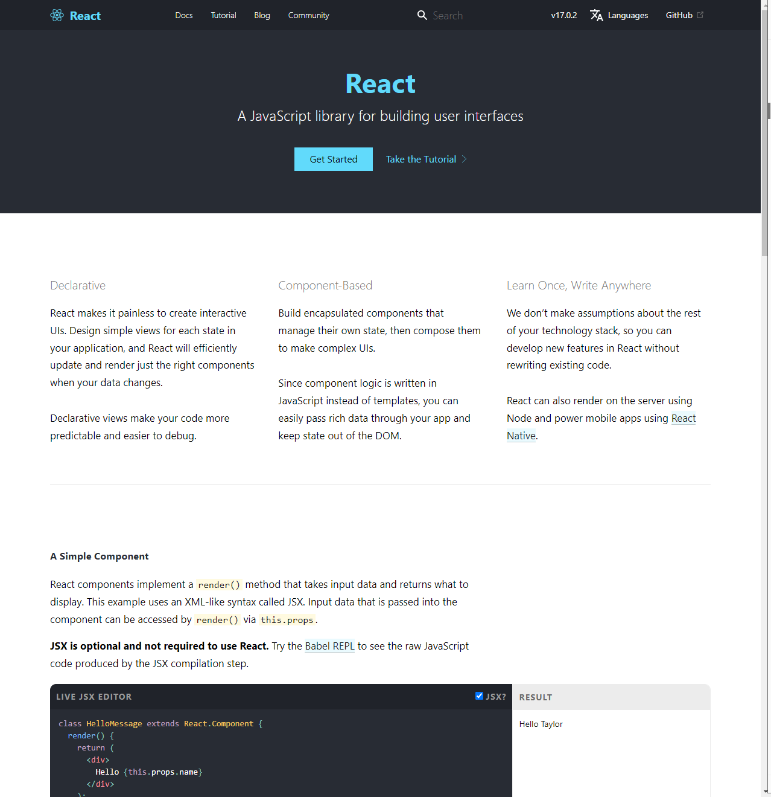
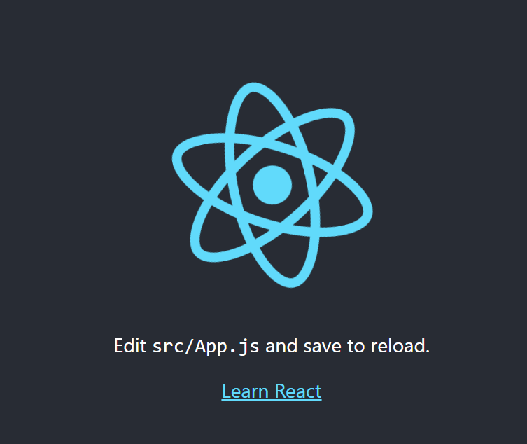
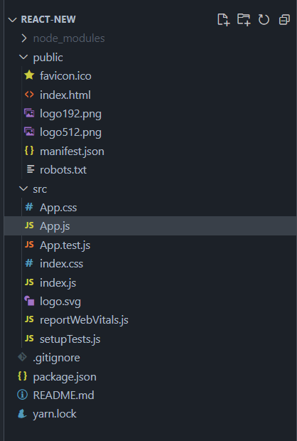

## React是什么

React 是一个用于构建用户界面的 JavaScript 库，是 Facebook 创建的。[官网](https://reactjs.org/)



## React历史

React.JS 的当前版本是 V17.0.2（2021 年 12月）。

2013 年 7 月首次向公众发布 (V0.3.0)。

React.JS 于 2011 年首次用于 Facebook 的 Newsfeed 功能。

Facebook 软件工程师 Jordan Walke 创建了它。

当前版本`create-react-app`为 v5.0.0（2021 年 12 月）。

`create-react-app` 包括 webpack、Babel 和 ESLint 等构建工具。


## React的特点

* 声明式

  以声明式编写 UI，可以让你的代码更加可靠，且方便调试。

* 组件化

  构建管理自身状态的封装组件，然后对其组合以构成复杂的 UI。

  由于组件逻辑使用 JavaScript 编写而非模板，因此你可以轻松地在应用中传递数据，并保持状态与 DOM 分离。

* 一次学习，跨平台编写

  无论你现在使用什么技术栈，在无需重写现有代码的前提下，通过引入 React 来开发新功能。

  React 还可以使用 Node 进行服务器渲染(next.js)，或使用 [React Native](https://reactnative.dev/) 开发原生移动应用,react vr。

## React安装

开始学习 React 的最快方法是直接在 HTML 文件中编写 React。

首先包含三个脚本，前两个让我们在 JavaScript 中编写 React 代码，第三个 Babel 允许我们在旧浏览器中编写 JSX 语法和 ES6。

* 通过cdn在线引入

```js
<script crossorigin src="https://unpkg.com/react@17/umd/react.development.js"></script>
<script crossorigin src="https://unpkg.com/react-dom@17/umd/react-dom.development.js"></script>
<script src="https://unpkg.com/@babel/standalone/babel.js"></script>
```

​	上述版本仅用于开发环境，不适合用于生产环境。压缩优化后可用于生产的 React 版本可通过如下方式引用：

```js
<script crossorigin src="https://unpkg.com/react@17/umd/react.production.min.js"></script>
<script crossorigin src="https://unpkg.com/react-dom@17/umd/react-dom.production.min.js"></script>
<script src="https://unpkg.com/@babel/standalone/babel.min.js"></script>
```

* 通过npm使用react

  需要结合browserify 或 webpack模块化构建工具，自行配置开发环境

* 使用creat-react-app快速构建react开发环境

  create-react-app 是来自于 Facebook，通过该命令我们无需配置就能快速构建 React 开发环境。

  create-react-app 自动创建的项目是基于 Webpack + ES6 。

  执行以下命令创建项目：

  ```shell
  npx create-react-app my-app
  cd my-app
  npm start
  ```

  **注意：** 如果您之前已`create-react-app`全局安装，建议卸载该软件包以确保 npx 始终使用最新版本的 `create-react-app`. 要卸载，运行此命令：`npm uninstall -g create-react-app`。

  在浏览器中打开 **http://localhost:3000/** ，结果如下图所示：

  

  项目目录结构如下：

  


## 渲染html

React 通过使用` ReactDOM.render()`在网页中渲染html，该`ReactDOM.render()`函数接受两个参数，HTML 代码和一个 HTML 元素。该函数的目的是在指定的 HTML 元素内显示指定的 HTML 代码。页面最终渲染在`public`文件夹里的`index.html`内。

## JSX语法

React 使用 JSX （JavaScript XML）来替代常规的 JavaScript。JSX 是一个看起来很像 XML 的 JavaScript 语法扩展。

我们不需要一定使用 JSX，但它有以下优点：

- JSX 执行更快，因为它在编译为 JavaScript 代码后进行了优化。
- 它是类型安全的，在编译过程中就能发现错误。
- 使用 JSX 编写模板更加简单快速。

```jsx
const element = <h1>Hello, world!</h1>;
```

这种看起来可能有些奇怪的标签语法既不是字符串也不是 HTML。

它被称为 JSX， 一种 JavaScript 的语法扩展。 我们推荐在 React 中使用 JSX 来描述用户界面。

JSX 是在 JavaScript 内部实现的。

我们知道元素是构成 React 应用的最小单位，JSX 就是用来声明 React 当中的元素。

与浏览器的 DOM 元素不同，React 当中的元素事实上是普通的对象，React DOM 可以确保 浏览器 DOM 的数据内容与 React 元素保持一致。

要将 React 元素渲染到根 DOM 节点中，我们通过把它们都传递给 ReactDOM.render() 的方法来将其渲染到页面上：

```jsx
var app = <div className="foo" />; 
ReactDOM.render(app, document.getElementById('example'));
```

*注意:*

*由于 JSX 就是 JavaScript，一些标识符像* `class` *和* `for` *不建议作为 XML 属性名。作为替代，React DOM 使用* `className` *和* `htmlFor` *来做对应的属性。*

### js表达式

我们可以在 JSX 中使用 JavaScript 表达式。表达式写在花括号 **{}** 中。实例如下：

```jsx
ReactDOM.render(
    <div>
      <h1>{1+1}</h1>
    </div>
    ,
    document.getElementById('example')
);
```

React 支持`if`语句，但*在*JSX 中不支持。

为了能够在 JSX 中使用条件语句，应该将这些`if` 语句放在 JSX 之外，或者可以使用三元表达式：

也可以写三元运算符

```jsx
ReactDOM.render(
    <div>
      <h1>{i == 1 ? 'True!' : 'False'}</h1>
    </div>
    ,
    document.getElementById('example')
);
```

### 顶级元素

代码块必须包含在一个顶级元素中，所以如果你想写*两个*段落，你必须把它们放在一个父元素中，就像一个`div`元素。

```jsx
const myelement = (
  <div>
    <p>I am a paragraph.</p>
    <p>I am a paragraph too.</p>
  </div>
);
```

*如果 HTML 不正确，或者 HTML 缺少父元素，JSX 将抛出错误。*

或者，您可以使用`Fragment`来包装多行。这将防止不必要地向 DOM 添加额外的节点。

片段看起来像一个空的 HTML 标签：`<></>`。

```jsx
const myelement = (
  <>
    <p>I am a paragraph.</p>
    <p>I am a paragraph too.</p>
  </>
);
```

或者

```jsx
const myelement = (
  <Fragment>
    <p>I am a paragraph.</p>
    <p>I am a paragraph too.</p>
  <Fragment/>
);
```


### 元素必须闭合

JSX 遵循 XML 规则，因此必须正确关闭 HTML 元素。

### 样式

React 推荐使用内联样式。我们可以使用 **camelCase** 语法来设置内联样式. React 会在指定元素数字后自动添加 **px** 。以下实例演示了为 **h1** 元素添加 **myStyle** 内联样式：

```jsx
var myStyle = {
    fontSize: 100,
    color: '#FF0000'
};
ReactDOM.render(
    <h1 style = {myStyle}>Hello world!</h1>,
    document.getElementById('example')
);		
```

### 使用className代替类名class

由于JSX是JavaScript，`class`关键字在js中是保留字，你不能再JSX中使用`class`，该用属性`className`。

JSX 通过使用`className`来解决这个问题。当 JSX 被渲染时，它`className` 会将属性转换为`class`属性。

### 数组

JSX 允许在模板中插入数组，数组会自动展开所有成员：

```jsx
var arr = [
  <h1>Hello</h1>,
  <h2>World!</h2>,
];
ReactDOM.render(
  <div>{arr}</div>,
  document.getElementById('example')
);
```

## React组件

在react中，组件就像返回的html元素的函数。

组件有两种类型，Class组件和Function组件。

*注意：*

*在较旧的 React 代码库中，你可能会发现主要使用 Class 组件。现在官方建议将 Function 组件与 Hooks 一起使用，Hooks 是在 React 16.8 中添加的。*

### class类组件

类组件必须包含该`extends React.Component`语句。该语句创建了对 React.Component 的继承，并使您的组件可以访问 React.Component 的函数。

该组件还需要一个`render()`方法，该方法返回 HTML。

```jsx
class Car extends React.Component {
  render() {
    return <h2>Hi, I am a Car!</h2>;
  }
}
```

### function组件

Function 组件也返回 HTML，其行为方式与 Class 组件大致相同，但 Function 组件可以使用更少的代码编写，更易于理解。

```jsx
function Car() {
  return <h2>Hi, I am a Car!</h2>;
}
```

### 渲染组件

现在你的 React 应用程序有一个名为 Car 的组件，它返回一个 `<h2>`元素。

要在您的应用程序中使用此组件，请使用与普通 HTML 类似的语法： `<Car />`

```jsx
ReactDOM.render(<Car />, document.getElementById('root'));
```

### Props

组件通过`props`传递属性，`props`作为函数参数，发送到组件中。

```jsx
function Car(props) {
  return <h2>I am a {props.color} Car!</h2>;
}

ReactDOM.render(<Car color="red"/>, document.getElementById('root'));
```

### 组件嵌套组件

我们可以在其他组件内部引用组件：

```jsx
function Car() {
  return <h2>I am a Car!</h2>;
}

function Garage() {
  return (
    <>
      <h1>Who lives in my Garage?</h1>
      <Car />
    </>
  );
}

ReactDOM.render(<Garage />, document.getElementById('root'));
```

### 文件组件

建议将组件拆分为单独的文件。为此，可以创建一个`.js`文件。将代码放入其中，通过 `export`	导出：

`Car.js`

```jsx
function Car() {
  return <h2>Hi, I am a Car!</h2>;
}

export default Car;
```

为了能够使用 Car 组件，您必须导入该文件。

```jsx
import React from 'react';
import ReactDOM from 'react-dom';
import Car from './Car.js';

ReactDOM.render(<Car />, document.getElementById('root'));
```


## 事件

就像 HTML DOM 事件一样，React 可以根据用户事件执行操作。

React 具有与 HTML 相同的事件：`click`、`input`、`mouseover`等。

### 添加事件

React 事件是用驼峰式语法编写的：

`onClick` 而不是`onclick`.

React 事件处理函数写在花括号内：

`onClick={shoot}` 而不是 `onClick="shoot()"`.

*React*

```jsx
<button onClick={shoot}>Take the Shot!</button>
```

*HTML*

```html
<button onclick="shoot()">Take the Shot!</button>
```

`组件中`

```jsx
function Football() {
  const shoot = () => {
    alert("Great Shot!");
  }

  return (
    <button onClick={shoot}>Take the shot!</button>
  );
}

ReactDOM.render(<Football />, document.getElementById('root'));
```

### 传递参数

要将参数传递给事件处理程序，请使用箭头函数。

```jsx
function Football() {
  const shoot = (a) => {
    alert(a);
  }

  return (
    <button onClick={() => shoot("Goal!")}>Take the shot!</button>
  );
}

ReactDOM.render(<Football />, document.getElementById('root'));
```

### 事件对象

事件处理函数可以访问触发函数的 React 事件。

```jsx
function Football() {
  const shoot = (a, b) => {
    alert(b.type);
    /*
    'b' represents the React event that triggered the function,
    in this case the 'click' event
    */
  }

  return (
    <button onClick={(event) => shoot("Goal!", event)}>Take the shot!</button>
  );
}

ReactDOM.render(<Football />, document.getElementById('root'));
```

## 条件渲染

在 React 中，您可以有条件地渲染组件。

有几种方法可以做到这一点。

### if语句

我们可以使用`if`JavaScript 运算符来决定渲染哪个组件。

```jsx
function Goal(props) {
  const isGoal = props.isGoal;
  if (isGoal) {
    return <MadeGoal/>;
  }
  return <MissedGoal/>;
}

ReactDOM.render(
  <Goal isGoal={false} />,
  document.getElementById('root')
);
```

### 逻辑`&&`运算符

另一种有条件地渲染 React 组件的方法是使用`&&`运算符。

```jsx
function Garage(props) {
  const cars = props.cars;
  return (
    <>
      <h1>Garage</h1>
      {cars.length > 0 &&
        <h2>
          You have {cars.length} cars in your garage.
        </h2>
      }
    </>
  );
}

const cars = ['Ford', 'BMW', 'Audi'];
ReactDOM.render(
  <Garage cars={cars} />,
  document.getElementById('root')
);
```

如果`cars.length` 等于真，则后面的表达式`&&`将呈现。

### 三元运算符

另一种有条件地呈现元素的方法是使用三元运算符。

```jsx
function Goal(props) {
  const isGoal = props.isGoal;
  return (
    <>
      { isGoal ? <MadeGoal/> : <MissedGoal/> }
    </>
  );
}

ReactDOM.render(
  <Goal isGoal={false} />,
  document.getElementById('root')
);
```


## Lists列表

------

在 React 中，您将使用循环渲染列表。

JavaScript`map()`数组方法通常是首选方法。

```jsx
function Car(props) {
  return <li>I am a { props.brand }</li>;
}

function Garage() {
  const cars = ['Ford', 'BMW', 'Audi'];
  return (
    <>
      <h1>Who lives in my garage?</h1>
      <ul>
        {cars.map((car) => <Car brand={car} />)}
      </ul>
    </>
  );
}

ReactDOM.render(<Garage />, document.getElementById('root'));
```

### key

类似于vue里面的列表循环，react的列表每一项也得需要绑定key，确保key值是项目唯一的字段，可以保证列表高效的更新。


```jsx
function Car(props) {
  return <li>I am a { props.brand }</li>;
}

function Garage() {
  const cars = [
    {id: 1, brand: 'Ford'},
    {id: 2, brand: 'BMW'},
    {id: 3, brand: 'Audi'}
  ];
  return (
    <>
      <h1>Who lives in my garage?</h1>
      <ul>
        {cars.map((car) => <Car key={car.id} brand={car.brand} />)}
      </ul>
    </>
  );
}

ReactDOM.render(<Garage />, document.getElementById('root'));
```

## 使用css

React里面使用css的方式有很多，下面主要说一下常用的三种：

- 内联样式
- CSS 样式表
- CSS 模块

### 内联样式

要使用内联样式属性设置元素样式，该值必须是 JavaScript 对象：

```jsx
const Header = () => {
  return (
    <>
      <h1 style={{color: "red"}}>Hello Style!</h1>
      <p>Add a little style!</p>
    </>
  );
}
```

**注意：**在 JSX 中，JavaScript 表达式写在花括号内，并且由于 JavaScript 对象也使用花括号，因此上面示例中的样式写在两组花括号内`{{}}`。

#### 驼峰式属性名称

由于内联 CSS 是在 JavaScript 对象中编写的，因此带有连字符分隔符的属性，例如`background-color`，必须使用驼峰式语法编写：

```jsx
const Header = () => {
  return (
    <>
      <h1 style={{backgroundColor: "lightblue"}}>Hello Style!</h1>
      <p>Add a little style!</p>
    </>
  );
}
```

#### JavaScript 对象

您还可以创建一个带有样式信息的对象，并在 style 属性中引用它：

```jsx
const Header = () => {
  const myStyle = {
    color: "white",
    backgroundColor: "DodgerBlue",
    padding: "10px",
    fontFamily: "Sans-Serif"
  };
  return (
    <>
      <h1 style={myStyle}>Hello Style!</h1>
      <p>Add a little style!</p>
    </>
  );
}
```

### css样式表

您可以在单独的文件中编写 CSS 样式，只需使用`.css`文件扩展名保存该文件 ，然后将其导入到您的应用程序中。

```css
body {
  background-color: #282c34;
  color: white;
  padding: 40px;
  font-family: Sans-Serif;
  text-align: center;
}
```

在您的应用程序中导入样式表：

```jsx
import React from 'react';
import ReactDOM from 'react-dom';
import './App.css';

const Header = () => {
  return (
    <>
      <h1>Hello Style!</h1>
      <p>Add a little style!.</p>
    </>
  );
}

ReactDOM.render(<Header />, document.getElementById('root'));
```


### css模块

向应用程序添加样式的另一种方法是使用 CSS 模块。

CSS 模块对于放置在单独文件中的组件很方便。

模块内的 CSS 仅对导入它的组件可用，您不必担心名称冲突。

使用`.module.css` 扩展名创建 CSS 模块，例如：`my-style.module.css`.

```css
.bigblue {
  color: DodgerBlue;
  padding: 40px;
  font-family: Sans-Serif;
  text-align: center;
}
```

在组件中导入样式表

```jsx
import styles from './my-style.module.css'; 

const Car = () => {
  return <h1 className={styles.bigblue}>Hello Car!</h1>;
}

export default Car;
```

## 使用sass预处理器

如果你`create-react-app`在你的项目中使用了，你可以很容易地在你的 React 项目中安装和使用 Sass。

通过在终端中运行以下命令来安装 Sass：

```shell
npm i sass -D
```

现在您就可以正常在项目里使用sass文件了

创建my-sass.scss文件：

```sass
$myColor: red;

h1 {
  color: $myColor;
}
```

用与导入 CSS 文件相同的方式导入 Sass 文件：

```jsx
import React from 'react';
import ReactDOM from 'react-dom';
import './my-sass.scss';

const Header = () => {
  return (
    <>
      <h1>Hello Style!</h1>
      <p>Add a little style!.</p>
    </>
  );
}

ReactDOM.render(<Header />, document.getElementById('root'));
```

## React Hooks

Hooks 在 16.8 版本中被添加到 React。

Hooks 允许函数组件访问状态和其他 React 特性。因此，通常不再需要类组件。

### 什么是Hooks钩子

Hooks 允许我们“挂钩”到 React 特性，例如状态和生命周期方法。

```jsx
import React, { useState } from "react";
import ReactDOM from "react-dom";

function FavoriteColor() {
  const [color, setColor] = useState("red");

  return (
    <>
      <h1>My favorite color is {color}!</h1>
      <button
        type="button"
        onClick={() => setColor("blue")}
      >Blue</button>
      <button
        type="button"
        onClick={() => setColor("red")}
      >Red</button>
      <button
        type="button"
        onClick={() => setColor("pink")}
      >Pink</button>
      <button
        type="button"
        onClick={() => setColor("green")}
      >Green</button>
    </>
  );
}

ReactDOM.render(<FavoriteColor />, document.getElementById('root'));
```

必须要从`react` `import`钩子（Hooks）

要想跟踪组件或者页面的数据状态，可以使用`useState` 钩子

类似于`vue`组件中的data，`react`里面的状态一般是指组建的数据或者属性。

#### Hooks规则

钩子有3条规则：

- 钩子 只能在 React 函数组件内部调用。
- 钩子只能在组件的顶层调用。
- 钩子不能有条件

**注意：**钩子在 React 类组件中不起作用。

### useState Hook

React `useState`Hook 允许我们跟踪函数组件中的状态。

状态通常是指需要在应用程序中跟踪的数据或属性。

#### import useState

要使用`useState`Hook，我们首先需要将`import`它添加到我们的组件中。

```jsx
import { useState } from "react";
```

请注意，我们正在解构`useState`，`react`因为它是一个命名导出。

#### 初始化 useState

我们通过调用`useState`我们的函数组件来初始化我们的状态。

`useState` 接受初始状态并返回两个值：

- 当前状态。
- 更新状态的函数。

```jsx
import { useState } from "react";

function FavoriteColor() {
  const [color, setColor] = useState("");
}
```

注意，useState返回的是一个数组，数组长度是2

第一个值`color`是我们当前的状态。

第二个值`setColor`是用于更新状态的函数。

将初始状态设置为空字符串： `useState("")`

#### 使用状态

```jsx
import { useState } from "react";
import ReactDOM from "react-dom";

function FavoriteColor() {
  const [color, setColor] = useState("red");

  return <h1>My favorite color is {color}!</h1>
}

ReactDOM.render(<FavoriteColor />, document.getElementById('root'));
```

#### 更新状态

为了更新我们的状态，我们使用我们的状态更新器功能

```jsx
import { useState } from "react";
import ReactDOM from "react-dom";

function FavoriteColor() {
  const [color, setColor] = useState("red");

  return (
    <>
      <h1>My favorite color is {color}!</h1>
      <button
        type="button"
        onClick={() => setColor("blue")}
      >Blue</button>
    </>
  )
}
```

注意：永远不应该直接更新状态。例如：`color = "red"`不允许。

#### 状态定义

该`useState`挂钩可以用来跟踪字符串，数字，布尔值，数组，对象，以及它们的任意组合！

我们可以创建多个状态挂钩来跟踪单个值。

```jsx
import { useState } from "react";
import ReactDOM from "react-dom";

function Car() {
  const [brand, setBrand] = useState("Ford");
  const [model, setModel] = useState("Mustang");
  const [year, setYear] = useState("1964");
  const [color, setColor] = useState("red");

  return (
    <>
      <h1>My {brand}</h1>
      <p>
        It is a {color} {model} from {year}.
      </p>
    </>
  )
}

ReactDOM.render(<Car />, document.getElementById('root'));
```

或者，可以只使用一种状态并包含一个对象！

```jsx
import { useState } from "react";
import ReactDOM from "react-dom";

function Car() {
  const [car, setCar] = useState({
    brand: "Ford",
    model: "Mustang",
    year: "1964",
    color: "red"
  });

  return (
    <>
      <h1>My {car.brand}</h1>
      <p>
        It is a {car.color} {car.model} from {car.year}.
      </p>
    </>
  )
}

ReactDOM.render(<Car />, document.getElementById('root'));
```

#### 更新对象和数组

当状态更新时，整个状态都会被覆盖。

如果我们只想更新我们汽车的颜色怎么办？

如果我们只调用`setCar({color: "blue"})`，这将从我们的状态中删除品牌、型号和年份。

我们可以使用 JavaScript 展开运算符来帮助我们。

```jsx
import { useState } from "react";
import ReactDOM from "react-dom";

function Car() {
  const [car, setCar] = useState({
    brand: "Ford",
    model: "Mustang",
    year: "1964",
    color: "red"
  });

  const updateColor = () => {
    setCar(previousState => {
      return { ...previousState, color: "blue" }
    });
  }

  return (
    <>
      <h1>My {car.brand}</h1>
      <p>
        It is a {car.color} {car.model} from {car.year}.
      </p>
      <button
        type="button"
        onClick={updateColor}
      >Blue</button>
    </>
  )
}

ReactDOM.render(<Car />, document.getElementById('root'));
```

因为我们需要 state 的当前值，所以我们将一个函数传递给我们的`setCar`函数。此函数接收先前的值。

然后我们返回一个对象，展开`previousState`并只覆盖颜色。

### useEffect Hook

该`useEffect`挂钩，可以在您的组件执行的副作用。

副作用一般指的是：获取数据、直接更新 DOM 和计时器。

`useEffect`接受两个参数。第二个参数是可选的。

```js
useEffect(<function>, <dependency>)
```

以计时器为例：

```jsx
import { useState, useEffect } from "react";
import ReactDOM from "react-dom";

function Timer() {
  const [count, setCount] = useState(0);

  useEffect(() => {
    setTimeout(() => {
      setCount((count) => count + 1);
    }, 1000);
  });

  return <h1>I've rendered {count} times!</h1>;
}

ReactDOM.render(<Timer />, document.getElementById('root'));
```

`useEffect`在每个渲染上运行。这意味着当计数改变时，渲染发生，然后触发另一个效果。

这不是我们想要的。有几种方法可以控制副作用何时发生。

我们应该始终包含接受数组的第二个参数。我们可以选择将依赖项传递给`useEffect`这个数组。

1.没有依赖通过：

```jsx
useEffect(() => {
  //每次渲染都会执行
});
```

2.空数组

```jsx
useEffect(() => {
  //第一次渲染才会执行
}, []);
```

3.传递prop或者state

```jsx
useEffect(() => {
  //第一次渲染执行
  //依赖发生改变都会触发执行
}, [prop, state]);
```

仅在初始渲染上运行效果：

```jsx
import { useState, useEffect } from "react";
import ReactDOM from "react-dom";

function Timer() {
  const [count, setCount] = useState(0);

  useEffect(() => {
    setTimeout(() => {
      setCount((count) => count + 1);
    }, 1000);
  } []); // <-  添加一个空的中括号

  return <h1>I've rendered {count} times!</h1>;
}

ReactDOM.render(<Timer />, document.getElementById('root'));
```

`useEffect`依赖于变量的Hook的示例。如果`count`变量更新，效果将再次运行：

```jsx
import { useState, useEffect } from "react";
import ReactDOM from "react-dom";

function Counter() {
  const [count, setCount] = useState(0);
  const [calculation, setCalculation] = useState(0);

  useEffect(() => {
    setCalculation(() => count * 2);
  }, [count]); // 添加count变量

  return (
    <>
      <p>Count: {count}</p>
      <button onClick={() => setCount((c) => c + 1)}>+</button>
      <p>Calculation: {calculation}</p>
    </>
  );
}

ReactDOM.render(<Counter />, document.getElementById('root'));
```

如果存在多个依赖项，则应将它们包含在`useEffect`依赖项数组中。

#### effect清理

某些副作用需要清理以减少内存泄漏

定时器，订阅事件，事件监听器和其他一些不在需要的副作用应该被处理掉。

通过在`useEffect`Hook的末尾包含一个返回函数来做到这一点。

清理`useEffect`Hook末尾的计时器：

```jsx
import { useState, useEffect } from "react";
import ReactDOM from "react-dom";

function Timer() {
  const [count, setCount] = useState(0);

  useEffect(() => {
    let timer = setTimeout(() => {
    setCount((count) => count + 1);
  }, 1000);

  return () => clearTimeout(timer)
  }, []);

  return <h1>I've rendered {count} times!</h1>;
}

ReactDOM.render(<Timer />, document.getElementById("root"));
```

**注意：**指定要清除的定时器名称即可

### useContext Hook

#### 上下文

React Context 是一种全局管理状态的方法。

它可以与`useState`Hook一起使用，比`useState`单独使用更容易在深度嵌套的组件之间共享状态。

通过嵌套传递props

```jsx
import { useState } from "react";
import ReactDOM from "react-dom";

function Component1() {
  const [user, setUser] = useState("Jesse Hall");

  return (
    <>
      <h1>{`Hello ${user}!`}</h1>
      <Component2 user={user} />
    </>
  );
}

function Component2({ user }) {
  return (
    <>
      <h1>Component 2</h1>
      <Component3 user={user} />
    </>
  );
}

function Component3({ user }) {
  return (
    <>
      <h1>Component 3</h1>
      <Component4 user={user} />
    </>
  );
}

function Component4({ user }) {
  return (
    <>
      <h1>Component 4</h1>
      <Component5 user={user} />
    </>
  );
}

function Component5({ user }) {
  return (
    <>
      <h1>Component 5</h1>
      <h2>{`Hello ${user} again!`}</h2>
    </>
  );
}

ReactDOM.render(<Component1 />, document.getElementById("root"));
```

即使组件 2-4 不需要状态，它们也必须传递状态以便它可以到达组件 5。

#### 解决方案

创建上下文

要创建上下文，您必须导入`createContext`并初始化它：

```jsx
import { useState, createContext } from "react";
import ReactDOM from "react-dom";

const UserContext = createContext()
```

接下来，我们将使用 Context Provider 来包装需要状态 Context 的组件树。

上下文中的provider

将子组件包装在 Context Provider 中并提供状态值。

```jsx
function Component1() {
  const [user, setUser] = useState("Jesse Hall");

  return (
    <UserContext.Provider value={user}>
      <h1>{`Hello ${user}!`}</h1>
      <Component2 user={user} />
    </UserContext.Provider>
  );
}
```

现在，此树中的所有组件都可以访问用户上下文。

使用`useContext`钩子

为了在子组件中使用 Context，我们需要使用`useContext`Hook访问它。

首先，`useContext`在导入语句中包含：

```jsx
import { useState, createContext, useContext } from "react";
```

然后就可以在所有组件中访问用户上下文：

```jsx
function Component5() {
  const user = useContext(UserContext);

  return (
    <>
      <h1>Component 5</h1>
      <h2>{`Hello ${user} again!`}</h2>
    </>
  );
}
```

使用 React Context 的完整示例：

```jsx
import { useState, createContext, useContext } from "react";
import ReactDOM from "react-dom";

const UserContext = createContext();

function Component1() {
  const [user, setUser] = useState("Jesse Hall");

  return (
    <UserContext.Provider value={user}>
      <h1>{`Hello ${user}!`}</h1>
      <Component2 user={user} />
    </UserContext.Provider>
  );
}

function Component2() {
  return (
    <>
      <h1>Component 2</h1>
      <Component3 />
    </>
  );
}

function Component3() {
  return (
    <>
      <h1>Component 3</h1>
      <Component4 />
    </>
  );
}

function Component4() {
  return (
    <>
      <h1>Component 4</h1>
      <Component5 />
    </>
  );
}

function Component5() {
  const user = useContext(UserContext);

  return (
    <>
      <h1>Component 5</h1>
      <h2>{`Hello ${user} again!`}</h2>
    </>
  );
}

ReactDOM.render(<Component1 />, document.getElementById("root"));
```

### useRef Hook

用于存储更新时不会导致重新渲染的可变值。

也可用于直接访问 DOM 元素。

#### 不会导致重新渲染

如果我们试图计算我们的应用程序使用`useState`Hook渲染的次数，我们将陷入无限循环，因为这个 Hook 本身会导致重新渲染。

为了避免这种情况，我们可以使用`useRef`Hook。

```jsx
import { useState, useEffect, useRef } from "react";
import ReactDOM from "react-dom";

function App() {
  const [inputValue, setInputValue] = useState("");
  const count = useRef(0);

  useEffect(() => {
    count.current = count.current + 1;
  });

  return (
    <>
      <input
        type="text"
        value={inputValue}
        onChange={(e) => setInputValue(e.target.value)}
      />
      <h1>Render Count: {count.current}</h1>
    </>
  );
}

ReactDOM.render(<App />, document.getElementById('root'));
```

`useRef()`只返回一项。它返回一个名为`current` 的对象。

这就像这样：`const count = {current: 0}`。我们可以使用`count.current`.

#### 访问DOM元素

一般来说，我们希望让 React 处理所有的 DOM 操作。

在 React 中，我们可以`ref`向元素添加属性以直接在 DOM 中访问它。

```jsx
import { useRef } from "react";
import ReactDOM from "react-dom";

function App() {
  const inputElement = useRef();

  const focusInput = () => {
    inputElement.current.focus();
  };

  return (
    <>
      <input type="text" ref={inputElement} />
      <button onClick={focusInput}>Focus Input</button>
    </>
  );
}

ReactDOM.render(<App />, document.getElementById('root'));
```

#### 跟踪状态变化

该`useRef` Hook也可以用于跟踪以前的状态值。

这是因为我们能够使用`useRef`在渲染之间保持原来的值。

```jsx
import { useState, useEffect, useRef } from "react";
import ReactDOM from "react-dom";

function App() {
  const [inputValue, setInputValue] = useState("");
  const previousInputValue = useRef("");

  useEffect(() => {
    previousInputValue.current = inputValue;
  }, [inputValue]);

  return (
    <>
      <input
        type="text"
        value={inputValue}
        onChange={(e) => setInputValue(e.target.value)}
      />
      <h2>Current Value: {inputValue}</h2>
      <h2>Previous Value: {previousInputValue.current}</h2>
    </>
  );
}

ReactDOM.render(<App />, document.getElementById('root'));
```

### useCallback Hook

React `useCallback`Hook 返回一个记忆化的回调函数。

注意：将记忆化视为缓存一个值，这样它就不需要重新计算。

这使我们能够隔离资源密集型函数，以便它们不会在每次渲染时自动运行。

当依赖有更新的时候，才会执行`useCallback` Hook

这可以提高性能。

#### 用法

使用useCallback可以防止组件重新渲染，除非props发生变化。

以下例子，Todos组件不会重新渲染：

index.js:

```jsx
import { useState, useCallback } from "react";
import ReactDOM from "react-dom";
import Todos from "./Todos";

const App = () => {
  const [count, setCount] = useState(0);
  const [todos, setTodos] = useState([]);

  const increment = () => {
    setCount((c) => c + 1);
  };
  const addTodo = useCallback(() => {
    setTodos((t) => [...t, "New Todo"]);
  }, [todos]);

  return (
    <>
      <Todos todos={todos} addTodo={addTodo} />
      <hr />
      <div>
        Count: {count}
        <button onClick={increment}>+</button>
      </div>
    </>
  );
};

ReactDOM.render(<App />, document.getElementById('root'));
```

Todos.js:

```jsx
import { memo } from "react";

const Todos = ({ todos, addTodo }) => {
  console.log("child render");
  return (
    <>
      <h2>My Todos</h2>
      {todos.map((todo, index) => {
        return <p key={index}>{todo}</p>;
      })}
      <button onClick={addTodo}>Add Todo</button>
    </>
  );
};

export default memo(Todos);
```

现在`Todos`组件只会在`todos`prop 改变时重新渲染。

### useMemo Hook

`useMemo`Hook 返回一个记忆值。

注意：将记忆化视为缓存一个值，这样它就不需要重新计算。

当依赖更新的时候就会触发`useMemo` Hook

这可以提高性能.

注意：`useMemo`和`useCallback`Hooks 是相似的。主要区别在于`useMemo`返回一个记忆值并 `useCallback`返回一个记忆函数.

#### 性能

使用`useMemo` Hook 可以处理不必要的资源密集型功能。

下面这个例子，在每次渲染上都会运行`expensiveCalculation`函数

更改计数或添加待办事项时，你会注意到执行延迟。

```jsx
import { useState } from "react";
import ReactDOM from "react-dom";

const App = () => {
  const [count, setCount] = useState(0);
  const [todos, setTodos] = useState([]);
  const calculation = expensiveCalculation(count);

  const increment = () => {
    setCount((c) => c + 1);
  };
  const addTodo = () => {
    setTodos((t) => [...t, "New Todo"]);
  };

  return (
    <div>
      <div>
        <h2>My Todos</h2>
        {todos.map((todo, index) => {
          return <p key={index}>{todo}</p>;
        })}
        <button onClick={addTodo}>Add Todo</button>
      </div>
      <hr />
      <div>
        Count: {count}
        <button onClick={increment}>+</button>
        <h2>Expensive Calculation</h2>
        {calculation}
      </div>
    </div>
  );
};

const expensiveCalculation = (num) => {
  console.log("Calculating...");
  for (let i = 0; i < 1000000000; i++) {
    num += 1;
  }
  return num;
};

ReactDOM.render(<App />, document.getElementById('root'));
```

#### 使用 useMemo

为了解决这个性能问题，我们可以使用`useMemo`Hook 来记忆`expensiveCalculation`函数。这将导致该函数仅在需要时运行。

我们可以使用`useMemo`包装`expensiveCalculation`函数。

`useMemo`接收第二个参数来声明它的依赖。`expensiveCalculation`函数只在依赖发生变化时执行。

在以下示例中，`expensiveCalculation`函数只会在`count` 更改时运行，而不会在添加待办事项时运行。

```jsx
import { useState, useMemo } from "react";
import ReactDOM from "react-dom";

const App = () => {
  const [count, setCount] = useState(0);
  const [todos, setTodos] = useState([]);
  const calculation = useMemo(() => expensiveCalculation(count), [count]);

  const increment = () => {
    setCount((c) => c + 1);
  };
  const addTodo = () => {
    setTodos((t) => [...t, "New Todo"]);
  };

  return (
    <div>
      <div>
        <h2>My Todos</h2>
        {todos.map((todo, index) => {
          return <p key={index}>{todo}</p>;
        })}
        <button onClick={addTodo}>Add Todo</button>
      </div>
      <hr />
      <div>
        Count: {count}
        <button onClick={increment}>+</button>
        <h2>Expensive Calculation</h2>
        {calculation}
      </div>
    </div>
  );
};

const expensiveCalculation = (num) => {
  console.log("Calculating...");
  for (let i = 0; i < 1000000000; i++) {
    num += 1;
  }
  return num;
};

ReactDOM.render(<App />, document.getElementById('root'));
```