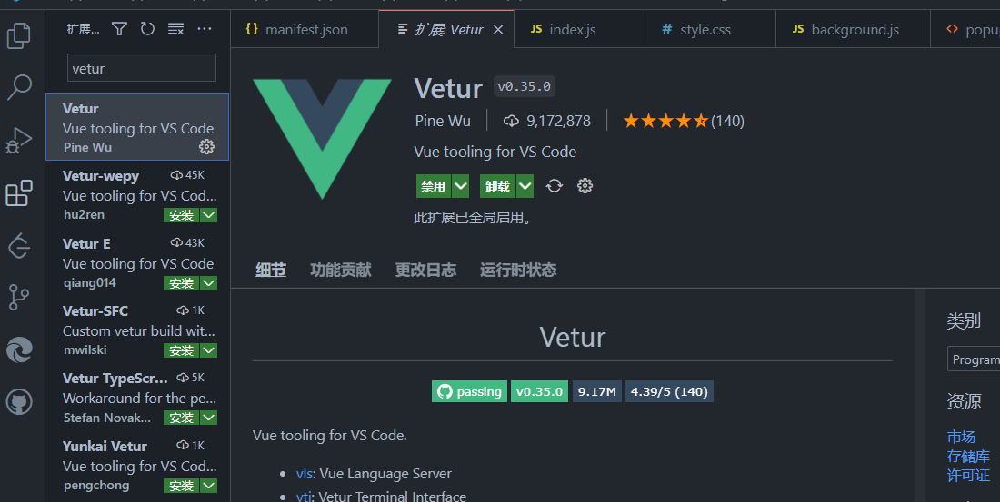
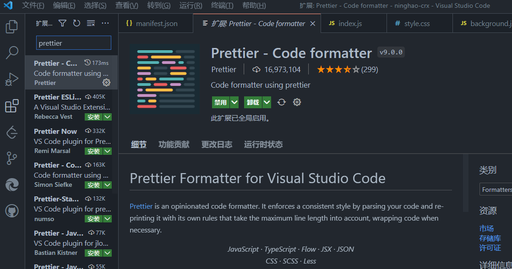
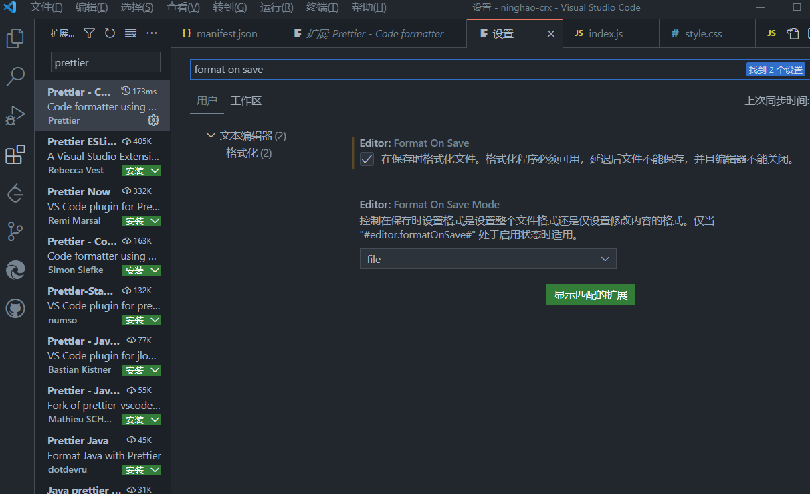

# vue讲解

## 理解框架

### 1、vscode：配置开发vue应用

使用 VSCode 开发 Vue 应用，可以简单配置一下。如果你发现 Vue 应用里的 vue 文件里的代码不能高亮显示，可以在编辑器安装一个 vetur 插件，打开编辑器的扩展管理，搜索 vetur，找到以后安装一下这个插件。

再打开应用里的一个 vue 文件，你会发现文件里的代码已经可以高亮显示了，这个 vetur 还提供了一个其它的功能，可以辅助我们开发 vue 应用。

另外代码的格式化也可以再安装一个扩展，搜索一下 prettier， 安装一下这个扩展。再打开编辑器的配置，搜索 format on save， 勾选一下 Format On Save 这个选项。

这样保存文件的时候，会自动格式化代码。

#### 针对项目设置prettier

在项目下面可以新建一个 prettier 的配置文件，文件的名字是 .prettierrc，这是一个 json 格式的文件，比如把自动格式化，设置为单引号，先把 singleQuote 这个配置设置成 true，再把 trailingCommna 设置成 all （使用单引号，尽可能在尾部使用逗号）。

现在，编辑代码，保存代码文件以后，会自动帮我们格式化代码。

参考：

* https://prettier.io/docs/en/configuration.html

* https://segmentfault.com/a/1190000022705000

### 2、Vue CLI： 项目命令行工具

Vue CLI 是创建管理 Vue 项目用的一个命令行工具，CLI 指的就是 Command Line Interface。下面我们可以把这个工具安装在系统上。

先打开终端，然后我们可以使用 npm 或者 yarn 这两个工具其中的一个，安装一下这个 vue-cli。 如果用 npm 安装的话，可以执行 npm install 要安装的是 @vue/cli ，后面再加上一个 --global 这个选项，表示要在全局范围安装这个东西。如果不加这个选项的话，就会把这个工具安装在当前这个目录的下面。 加上 --global 以后，可以在任何地方使用这个命令行工具。

安装完成以后，在终端就可以使用 vue 这个命令，执行一下 vue create 项目名称 ，按照提示按需安装项目所需依赖就可以。

### 3、理解项目目录

新建一个终端标签，安装了 VSCode 编辑器以后，会带一个 code 命令，用这个命令打开我们的这个项目目录。如果你发现没法用 code 命令，也可以先打开 VSCode 编辑器，然后执行一下打开目录，找到项目目录，确定打开就行了。

在项目根目录下面会有一些文件，这些文件一般就是项目里用的一些工具的配置文件，比如这个 .browserslistrc，你可以在这个文件里说明一下项目支持的浏览器，项目里的一些工具会根据这个文件里的配置信息，去做出相应的反应。

.eslintrc.js，这个是 eslint 工具的配置文件。你可以在这里配置一下代码检查的一些规则。

.gitignore 文件里写的是项目在做源代码的时候，要忽略掉的项目里的一些文件。

package.json，里面描述了我们项目里定义的命令，还有项目的依赖。比如刚才运行项目开发服务的时候，用的就是这个 serve 命令，实际上这个命令对应的是后面这个 vue-cli-service serve 这个命令。也就是在执行 yarn serve 或者 npm run serve 的时候，实际上执行的是 vue-cli-service serve 命令。

dependencies 下面列出的是项目当前依赖的一些东西，这里现在有 vue 框架，还有 vue-router 跟 vuex。

devDependencies 是项目的开发依赖，也就是这里列出的东西，一般只用在项目的开发阶段，应用在正式运行的时候，可能用不到这些东西。

README.md 是项目的说明。

tsconfig.json 是 TypeScript 用的配置文件。

yarn.lock 是项目里安装的所有的包相关的信息。因类之前创建这个 Vue 项目的时候，vue-cli 应该用的是 yarn 安装的项目依赖，所以才会有这个文件。如果用的是 npm 安装的包，项目里应该会有一些 package-lock.json ，文件里同样就是项目里安装过的所有的包相关的一些信息。

这些安装的包，会放在项目的 node_modules 目录里面。

public 里面有一些公开的资源，比如 favicon.ico，就是在浏览器标签旁边显示的一个小图标。 还有 index.html ，这是我们开发的应用需要的一些网页文件。

src 目录下面的东西是项目的源代码，也就是我们在开发的时候，写的代码全部都会放在这个目录的下面，比如创建的 Vue 组件，组件的样式，还有应用的 Store 等等。

如果项目使用的 TypeScript，项目里的一些脚本文件的后缀是 .ts ，表示 typescript，如果在项目里没有选择使用 TypeScript，文件的后缀应该是 .js 。

..... https://cn.vuejs.org/v2/guide/

